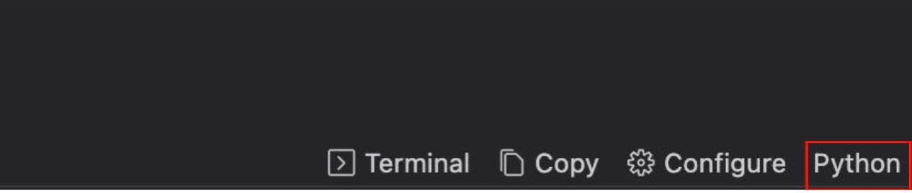
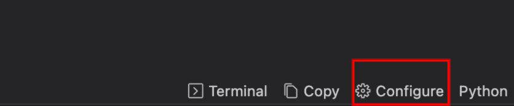
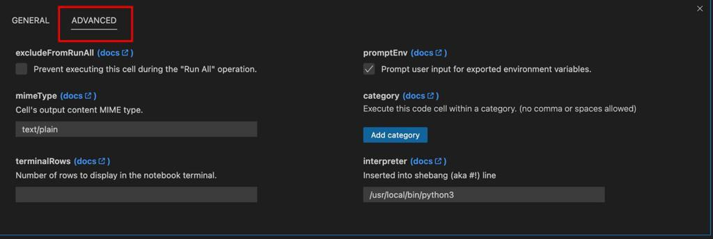
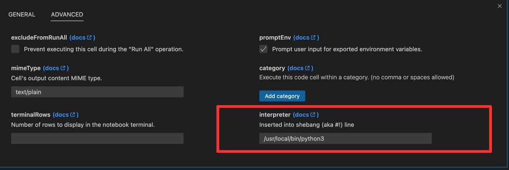
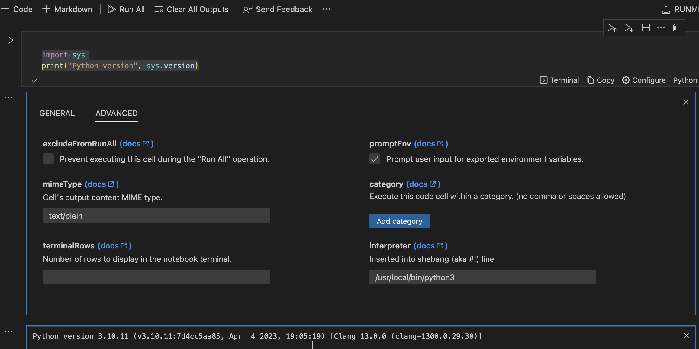

# Runme Integrated With Shebang

Runme revolutionizes the execution of runbooks by transforming them into executable documents, streamlining the process of following step-by-step instructions. This innovation ensures that operational documents, such as runbooks, playbooks, and procedural guides, remain reliable and are less prone to becoming outdated or incorrect over time.

Shebang, on the other hand, is a versatile utility designed to execute scripts written in various scripting languages including Shell, Perl, Python, and more. The term 'Shebang' is derived from the '#!' symbol, which is used at the beginning of scripts to define the interpreter that should be used to run the script.

## Prerequisites

Before proceeding with the integration of Shebang in [Runme](/install#runme-cli), ensure that Runme is properly installed on your system. This is a crucial step to guarantee the smooth execution of your runbooks

## Configuring Shebang in Visual Studio Code

Visual Studio Code (VSCode) provides a user-friendly interface for configuring Shebang. Follow the steps below to set up Shebang in VSCode.

You can switch to the programming language using the feature for selecting a language interpreter that allows users to configure the environment for running code directly within the editor



Follow the steps below to set up Shebang in VSCode:

1. Open your script (markdown file) in VSCode
2. Click on "Configure" menu



3. Click on "Advance"



4. Set the path to the interpreter
   
5. close the modular
6. Execute the Runme command:

```sh
# short for "runme tui" is 
runme
```



## Setting Up Shebang Using CLI

Shebang can be easily configured for different scripting languages using the command line interface (CLI). Below is an example of how to set up Shebang for a Bash script:

```sh
#!/bin/bash
echo "Hello, World!"
```

In this example, the **#!/bin/bash** line tells the system to use Bash as the interpreter for the code. You can replace /bin/bash with the path to the interpreter for the scripting language of your choice.

To execute the code using Runme CLI, simply navigate to the directory containing your code and run the following command:

```sh
runme run test.md
```

Replace test.md with the name of your script file.