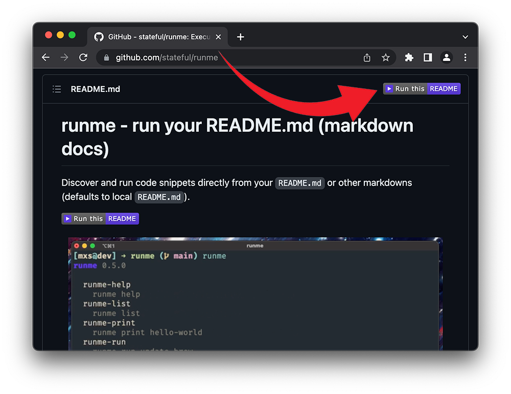

# Runme Browser Extension

If you like to quickly checkout a GitHub project from your browser, you can use the Runme Web Extension. It is supported in all Chromium browser (e.g. Chrome, Brave or Opera) as well as on Firefox. You can download the extension through:

- [Chrome Web Store](https://chrome.google.com/webstore/detail/runme-web-extension/lnihnbkolojkaehnkdmpliededkfebkk?hl=en&authuser=0)
- [Mozilla Addon](https://addons.mozilla.org/en-GB/firefox/addon/runme/)

The web extension adds Runme links to the following places:

### Local Clone Section

### Markdown Title Header

### Code Sections

You can find more information about the development of this web-extension at [`stateful/runme-web-extension`](https://github.com/stateful/runme-web-extension). Feel free to provide feedback and suggestions at any time.
