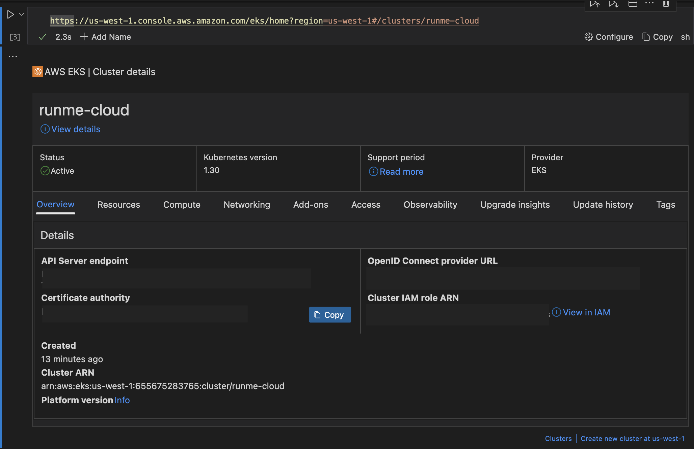

---
runme:
  id: 01J1ASZDP12DG2YF681CEAEHY3
  version: v3
---

Runme is an interactive notebook that allows you to run codes and commands and document your workflows directly in your Markdown file. To enhance its capabilities, Runme integrates with various cloud services, one of which is the AWS Elastic Kubernetes Service (EKS).

AWS EKS is a managed Kubernetes service that makes it easy to run Kubernetes on AWS without installing and operating your own Kubernetes control plane or nodes. The integration of Runme with AWS EKS makes it easy to scale applications from your Markdown file and promotes collaboration between teammates.

In this guide, we will explore how you can leverage this for cloud rendering.

## Prerequisite

To follow up on this tutorial, carry out the following:

- **Install Runme:** Install the [Runme extension on VS Code](https://marketplace.visualstudio.com/items?itemName=stateful.runme) and set it as your [default Markdown viewer.](https://docs.runme.dev/installation/installrunme#how-to-set-vs-code-as-your-default-markdown-viewer)
- **Clone the repository:** You need to clone [this repository](https://github.com/stateful/vscode-runme). It contains all the commands needed to [set up](https://github.com/stateful/vscode-runme/blob/main/examples/aws/setup.md) and [follow up](https://github.com/stateful/vscode-runme/blob/main/examples/aws/eks.md) on this tutorial.
- **Install AWS CLI:** For UNIX-based systems (macOS and Linux), you can use `Homebrew` to install `awscli`. To do that, run the command below:

```bash {"id":"01J1ASZDP12DG2YF680TJWTRJ5"}
brew install awscli
```

To install on other platforms, check out the [AWS documentation](https://docs.aws.amazon.com/cli/latest/userguide/getting-started-quickstart.html).

## Getting Started

This section will explore how to set up your AWS profile.

### Setting Up Your Working AWS Profile

After installing the AWS CLI, it stores your configuration settings and credentials in files.

Within a credentials file, information is organized into profiles, each potentially holding data such as your **AWS Access Key ID** and **AWS Secret Access Key**.

**List Configured Profiles**

You can create as many profiles as you need. Each profile has a unique set of credentials and configuration settings. To get a list of configured profiles, run the command below.

```bash {"id":"01J1ASZDP12DG2YF680YG0KB06"}
aws configure list-profiles
```

To display profile details, including access key, secret key, and region configuration information utilized for a specific profile, you can leverage Runme’s environment variable prompt and execute the following commands:

```bash {"id":"01J1ASZDP12DG2YF680ZWS9MEQ"}
export PROFILE_NAME="default"
echo "PROFILE NAME SET TO $PROFILE_NAME"
```

```bash {"id":"01J1ASZDP12DG2YF6811CEN9W8"}
aws configure list --profile $PROFILE_NAME
```

When both commands are executed individually in your Runme code cell, you will get outputs similar to the image below.

**Configuring a Default Profile**

If you haven't configured a profile yet, you can create a default one by running the command below. Ensure you have your Access Key ID and Secret Access Key because you will be prompted to enter them.

```bash {"id":"01J1ASZDP12DG2YF6813G1SR6N"}
aws configure
```

Here is a visual representation of the output.

Your AWS CLI is correctly configured, and you can proceed to the next section.

## Working with EKS Clusters

In the sections below, you will discover how you can leverage Runme's robust Notebook Cloud Renderers to engage with your EKS resources in ways you've never imagined before!

### List EKS Clusters

One of the fundamental tasks in working with EKS is listing your clusters. Listing EKS clusters gives you a snapshot of all your clusters and their statuses and ensures your Kubernetes environment is running smoothly and efficiently.

Runme seamlessly integrates with your AWS EKS resource URLs, mirroring your navigation in the AWS Console directly within your Notebook. This eliminates the need to open the console separately; you can access its functionality within your Notebook file.

To test this out, run the command below. Ensure to set your region.

```bash {"id":"01J1ASZDP12DG2YF6816BNW44M"}
export EKS_REGION="us-east-1"
echo "EKS_REGION set to $EKS_REGION"
```

When this command is executed, this is the output interface.

Next, run the command below to experience the Runme Cloud Renderer in action.

```bash {"id":"01J1ASZDP12DG2YF6818DEFVV0"}
https://$EKS_REGION.console.aws.amazon.com/eks/home?region=$EKS_REGION#/clusters
```

This is the resulting interface. Isn’t it cool?


It also possesses useful links to your AWS console below the table, as shown in the image above.

### Display a Specific EKS Cluster

When you execute an AWS console link for specific cluster details, you will have a similar experience to listing EKS clusters, which offers a comprehensive breakdown of the instance’s details.

To experience this firsthand, run the commands below.

```bash {"id":"01J1ASZDP12DG2YF68197RG3BX"}
export EKS_CLUSTER="runme-cloud"
export EKS_REGION="us-west-1"
echo "EKS_CLUSTER set to $EKS_CLUSTER"
echo "EKS_REGION set to $EKS_REGION"
```

Be sure to replace the cluster placeholder with the instance you want to visualize, as in the image below.


Next, run this command:

```bash {"id":"01J1ASZDP12DG2YF681AVWHAY9"}
https://$EKS_REGION.console.aws.amazon.com/eks/home?region=$EKS_REGION#/clusters/$EKS_CLUSTER
```

This will unlock the visual display of the specific EKS cluster details.



If you would love to navigate to the AWS console for that cluster, click the **view detail**s icon.

## Feedback and Contribution

We are still developing more features for the Runme Cloud Renderers. If you have feedback on this or new ideas on how to improve this feature, feel free to [reach out to us](https://github.com/stateful/runme?tab=readme-ov-file#feedback).
