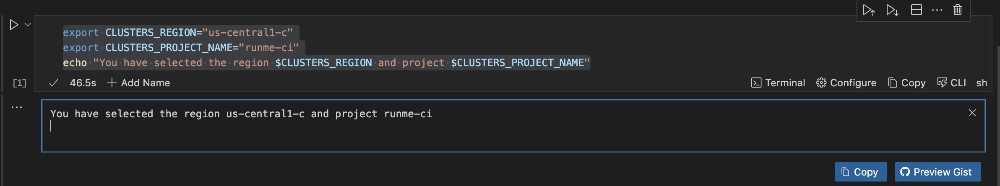

---
runme:
  id: 01J1AM4C0T1S197M3R3MKPXFDB
  version: v3
  document:
    relativePath: gcp.md
  session:
    id: 01J1AM3GFVY2KNNQ79M1PDPDBX
    updated: 2024-06-27 10:27:29+01:00
---

## Runme with Google Cloud

## Prerequisites

 Via Homebrew

```sh {"id":"01J1ANGXDNJ462THYDNVPWZJTP"}
$ brew install --cask google-cloud-sdk
```

## Setting Up gcloud SDK in Your Notebook

use the [environment vairable](ht************************************************************************ts) to set the your project id

```sh {"id":"01J1AQK0KF874HAGT2HGYG3VFK"}
export PROJECT_ID="runme-ci"
echo "PROJECT_ID set to $PROJECT_ID"
```

To utilize this feature, simply paste a link from the console, specifying the desired project for visualization.

ht******************************************************ct=$PROJECT_ID


## Working with GCE 

## List clusters

speak on using env feature

To list your Kubernetes clusters, you need to specify a region and the project identifier, run the following command:

```sh {"id":"01J1CG1ZG3J6YEXDR00C1ZN21S"}
export CL***********ON="us*********-c"
export CLUSTERS_PROJECT_NAME="runme-ci"
echo "You have selected the region $CLUSTERS_REGION and project $CLUSTERS_PROJECT_NAME"
```

