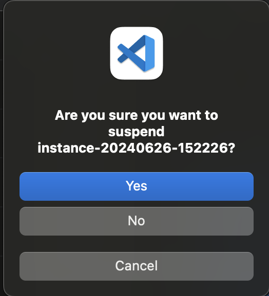
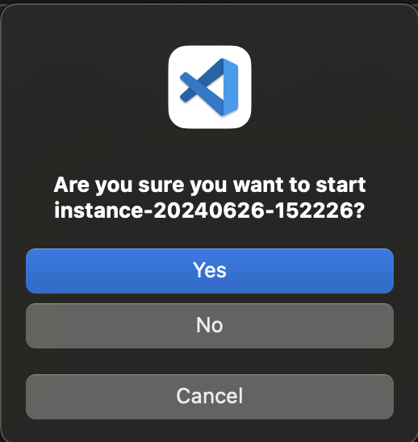
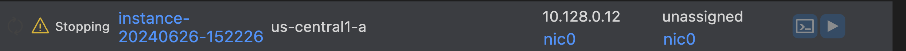
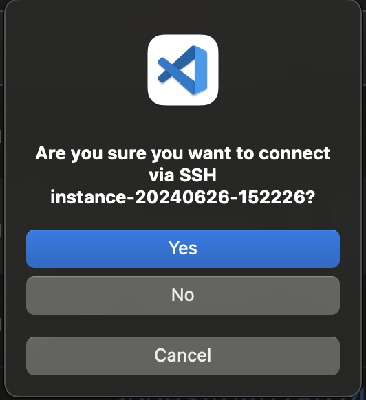
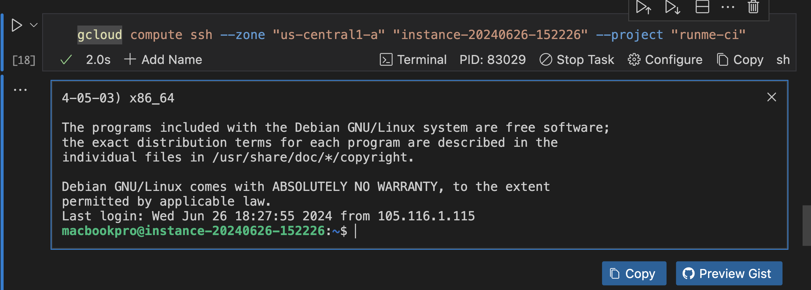
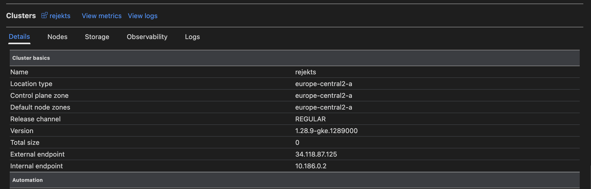
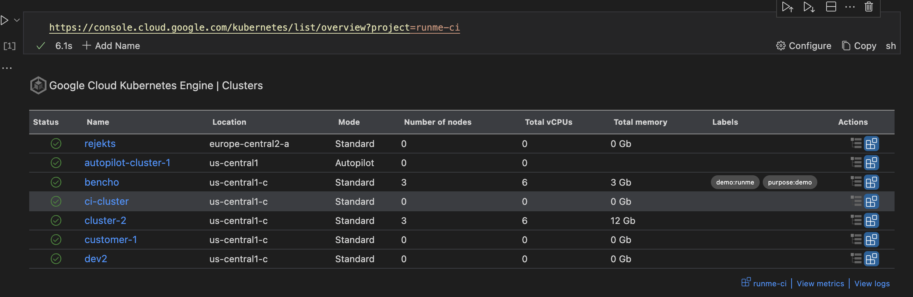

---
runme:
  id: 01J1AM4C0T1S197M3R3MKPXFDB
  version: v3
  document:
    relativePath: gcp.md
  session:
    id: 01J1CQVRMFX9CWR4ZJ94A03R46
    updated: 2024-06-27 15:11:39+01:00
---

## Runme with Google Cloud Engine 

## Prerequisites

 Via Homebrew

```sh {"id":"01J1ANGXDNJ462THYDNVPWZJTP"}
$ brew install --cask google-cloud-sdk
```

```sh {"id":"01J1CX6BXBBQ433QSKDNYDX3Q5"}
$ gcloud auth login
```

Setup default credentials

```sh {"id":"01J1CX90BA6VECCBJAWSWA369W"}
gcloud auth application-default login
```

## Setting Up gcloud SDK in Your Notebook

use the [environment vairable](ht************************************************************************ts) to set the your project id

```sh {"id":"01J1AQK0KF874HAGT2HGYG3VFK"}
export PROJECT_ID="runme-ci"
echo "PROJECT_ID set to $PROJECT_ID"
```

To utilize this feature, simply paste a link from the console, specifying the desired project for visualization.

ht******************************************************ct=$PROJECT_ID

Here, "runme-ci" serves as the project identifier.

You'll be presented with a resources table akin to the Google Cloud interface, seamlessly integrated into your Runbook environment!

```sh {"id":"01J1CXFZ8AS8VS42KX85A1D7HK"}
ht******************************************************ct=$PROJECT_ID
```


Secure SSH connections
Pausing, stopping, terminating instances.

### Pause

- click on the pause logo 
- you will be promote to pause `yes` or `no` 




### Start instance 

- click start the logo 
- you will be promoted to start, click yes or no 



the instance is starting 


hshld


### STOP




ssh 





## Working with GCE

## List clusters

To utilize this feature, simply paste a link from the console, specifying the desired project for visualization.

You'll be presented with a resources table akin to the Google Cloud interface, seamlessly integrated into your Runbook environment!

Run the following command (ensure you have provided a valid value for project-id)

```sh {"id":"01J1D05NR48FG1QYVD6RDF9KJ5"}
ht************************************************************************id
```

You can also paste a cluster details link:

```sh {"id":"01J1D06MS1PAJZY8ATX90B7K77"}
ht********************************************************ls/[location]/[account]/details?project=[project]
```

```sh {"id":"01J1D02EEJ0QRCKQ6AXER8Q4G4"}
ht**********************************************************************ci

# Ran on 2024-06-27 15:02:32+01:00 for 6.12s
{
	"type": "stateful.runme/gcp",
	"output": {
		"project": "runme-ci",
		"view": "clusters",
		"cellId": "01J1D02EEJ0QRCKQ6AXER8Q4G4",
		"clusters": [
			{
				"clusterId": "a69e3443bf154aa2b38ebd48fa4e32762ef85c8733e34d85bfbbe1f3ad405e89",
				"status": "RUNNING",
				"name": "rejekts",
				"location": "europe-central2-a",
				"mode": "Standard",
				"nodes": 0,
				"clusterLink": "https://console.cloud.google.com/kubernetes/clusters/details/europe-central2-a/rejekts/details?project=runme-ci",
				"vCPUs": 0,
				"totalMemory": 0,
				"labels": {},
				"statusMessage": ""
			},
			{
				"clusterId": "7b6fc10776e84e529663e633eb6eeb3b2899633681f241338ae68107d4d426ef",
				"status": "RUNNING",
				"name": "autopilot-cluster-1",
				"location": "us-central1",
				"mode": "Autopilot",
				"nodes": 0,
				"clusterLink": "https://console.cloud.google.com/kubernetes/clusters/details/us-central1/autopilot-cluster-1/details?project=runme-ci",
				"vCPUs": 0,
				"totalMemory": 0,
				"labels": {},
				"statusMessage": ""
			},
			{
				"clusterId": "3df59ac0e52f4189bd72f88e83bc19c9316bdb92106243d8917f5c7a65960590",
				"status": "RUNNING",
				"name": "bencho",
				"location": "us-central1-c",
				"mode": "Standard",
				"nodes": 3,
				"clusterLink": "https://console.cloud.google.com/kubernetes/clusters/details/us-central1-c/bencho/details?project=runme-ci",
				"vCPUs": 6,
				"totalMemory": 3,
				"labels": {
					"demo": "runme",
					"purpose": "demo"
				},
				"statusMessage": ""
			},
			{
				"clusterId": "fb6b7532f097404696ee092fbd5fd87660d89ba36a31431fb79ab91cbf1d62b1",
				"status": "RUNNING",
				"name": "ci-cluster",
				"location": "us-central1-c",
				"mode": "Standard",
				"nodes": 0,
				"clusterLink": "https://console.cloud.google.com/kubernetes/clusters/details/us-central1-c/ci-cluster/details?project=runme-ci",
				"vCPUs": 0,
				"totalMemory": 0,
				"labels": {},
				"statusMessage": ""
			},
			{
				"clusterId": "4a30ff7fbcd84925af68d2ea2c68ad0d8d8cd757c93c4232a7f76e207f16fcc7",
				"status": "RUNNING",
				"name": "cluster-2",
				"location": "us-central1-c",
				"mode": "Standard",
				"nodes": 3,
				"clusterLink": "https://console.cloud.google.com/kubernetes/clusters/details/us-central1-c/cluster-2/details?project=runme-ci",
				"vCPUs": 6,
				"totalMemory": 12,
				"labels": {},
				"statusMessage": ""
			},
			{
				"clusterId": "5e231cca17f34d15852d306ef8522eb9490ea17630c740abbbc3a35a1e092d07",
				"status": "RUNNING",
				"name": "customer-1",
				"location": "us-central1-c",
				"mode": "Standard",
				"nodes": 0,
				"clusterLink": "https://console.cloud.google.com/kubernetes/clusters/details/us-central1-c/customer-1/details?project=runme-ci",
				"vCPUs": 0,
				"totalMemory": 0,
				"labels": {},
				"statusMessage": ""
			},
			{
				"clusterId": "aec2353ea227485abd7603c096878c4f9249bc6d9e76426d8481eef04c9a12cc",
				"status": "RUNNING",
				"name": "dev2",
				"location": "us-central1-c",
				"mode": "Standard",
				"nodes": 0,
				"clusterLink": "https://console.cloud.google.com/kubernetes/clusters/details/us-central1-c/dev2/details?project=runme-ci",
				"vCPUs": 0,
				"totalMemory": 0,
				"labels": {},
				"statusMessage": ""
			}
		]
	}
}
```

click on actions the button

```sh {"background":"false","id":"01J1D07SGQ84ZH1GZSYYVGFTC3"}
ht***********************************************************************************************************ci

# Ran on 2024-06-27 15:05:23+01:00 for 2.198s
{
	"type": "stateful.runme/gcp",
	"output": {
		"project": "runme-ci",
		"view": "cluster",
		"cellId": "01J1D07SGQ84ZH1GZSYYVGFTC3",
		"cluster": "rejekts",
		"clusterDetails": {
			"itFailed": false,
			"data": {
				"clusterBasics": {
					"name": "rejekts",
					"locationType": "europe-central2-a",
					"releaseChannel": "REGULAR",
					"version": "1.28.9-gke.1289000",
					"totalSize": 0,
					"externalEndpoint": "34.118.87.125",
					"privateEndpoint": "10.186.0.2",
					"clusterCertificate": "LS0tLS1CRUdJTiBDRVJUSUZJQ0FURS0tLS0tCk1JSUVMRENDQXBTZ0F3SUJBZ0lRSWovWk5WYjFXOUtpZHBjUlZrc0czakFOQmdrcWhraUc5dzBCQVFzRkFEQXYKTVMwd0t3WURWUVFERXlRME9HWTBZbVV3T0MxaVptTXdMVFF3T0dFdFlUQTRZeTAzTkRneE5UUTBaVEppTlRZdwpJQmNOTWpRd016RTNNRFl6TVRJeFdoZ1BNakExTkRBek1UQXdOek14TWpGYU1DOHhMVEFyQmdOVkJBTVRKRFE0ClpqUmlaVEE0TFdKbVl6QXROREE0WVMxaE1EaGpMVGMwT0RFMU5EUmxNbUkxTmpDQ0FhSXdEUVlKS29aSWh2Y04KQVFFQkJRQURnZ0dQQURDQ0FZb0NnZ0dCQUpqb3V4RHNaR21yTmEwRVZVdm5aYmt6aUh5cS9rc0V0RTVVUEV6MgpUcXc2RVRocURSc0txaTNIMHNXdEdmRGhUcGtHL3A4aGl6NExCWFYrN05mczV6M3hzYmpFQnhaaGpKVXV2TlgrCkt3SmtlYWx4a2VKNExIcUpjNFdQRGlSUkJMcjhQU2gyUnptSEN4akNlRjFxdlg1bkk3OG9ZSThkOG5PM2k4YWwKZGVnUzdmaUhzVmR5V09yK2tGQkhncjBhSDBQaisvRnVRcjkzUko4Vzh3WUJQaVUyY0Q5T0wxZGlkR0JXL21zNQpoK0c5NENJcmRjTU5VYlRQSjNSaXdrQkwxM0I5U3RxTnJ1bnBkWENDTWRaS3NNUWtPcGFtYndlenNheWNGUmdoCklXL0RUeE5Yekw1bnRDVkl0NDRRWVJWdlRHbGQ2MmVVa1pSSzVQTHk3bGVMenhZaUduZHFXa3ZzeHhHVHpLTlgKaFdmdURsL1NoNFQ2M2VqMU5jNFljTTFkWmNuZjlSSWdGdzZsbis1dVExWnB0b0xGekw1YWdMMUpQVC9GV01sVQpObWI1NmhvRytHcEVmTkg1YmFRSWQrN0k4cHBJeVBMNEcveEdBS0YySHNnQjN2MHJsZ2RqZ1R4NDgrUkVlSnhGCnQwTlpNSlNobWV3UkNGOXR0L0dBZklCNFdRSURBUUFCbzBJd1FEQU9CZ05WSFE4QkFmOEVCQU1DQWdRd0R3WUQKVlIwVEFRSC9CQVV3QXdFQi96QWRCZ05WSFE0RUZnUVVrUkRHT0pxS3B4QzZZU0tIcGhmSEZRSkl0ZE13RFFZSgpLb1pJaHZjTkFRRUxCUUFEZ2dHQkFGYjJERkJwYWQ2VjQvWDlJeFpqbDlDa2xpT3A0eURYekFpTm0yMDcyZlpZCnZWZmxRNUtGWVQ4NTRqeEk0U1Y0REFKNmdpQkRXMVJIQVBGdXg5azBQd2dRWnFnclVPM0xrY3pwdTMrd1I5T2QKek9pMGd0VHRnZEI4WTRackJoZlplMGNqSmNpSy9FTXMzR0p3WGRuQUVVK2VMS1BZZE9GV1pMaERvcDVpbkRNZwo5K3dTYldJdHo1YkRyQVV6VC9FOFBxZDE0YzcwRTd2M1JId1VrdEJ1Y0pqTHNKRm51dXQxbkxTQms3dVNpOEVVCldHR09sMWZaVTgrT29CY1lhSWxGYklBYnZ3S2ZOc2E0VVZWTElsRDhZUTFidkdyZXlaeUNEc0pCNC9DSks4RXcKMUxsOEdkNzFSM0ZpTEp4MDlRbnlHQTh1RVNYK1BBSnJwUTVjQ21BYlZ2ZmFnM015N0dVNVd4RVQ2bTNEM09BUQpLL3dMTUZWUWJxTUFiWllkYngvZzIyNy9wSElXTlhsZlJNM0dyMVdnT3dZQzV2ZG1ESmc0TGtjRm1pR3NzSXMzCmN4L0crREJRNENDVC9XTUxscVJyTWRVQndFSzNRWEd5SkgyRGFGbU85dGlKb21tYVJkMjNSTm02WWF2Q1pGSlkKdVVVRnprdGljRlI3TVBEdnBHOFI3dz09Ci0tLS0tRU5EIENFUlRJRklDQVRFLS0tLS0K",
					"basicCredentialsEnabled": false,
					"node": []
				},
				"automation": {
					"maintenance": null,
					"notifications": {
						"enabled": false,
						"topic": "",
						"filter": null
					},
					"verticalPodAutoscaling": null,
					"autoscaling": {
						"resourceLimits": [],
						"autoprovisioningLocations": [],
						"enableNodeAutoprovisioning": false,
						"autoscalingProfile": "BALANCED",
						"autoprovisioningNodePoolDefaults": null
					}
				},
				"networking": {
					"privateCluster": {
						"enablePrivateNodes": false,
						"enablePrivateEndpoint": false,
						"masterIpv4CidrBlock": "",
						"privateEndpoint": "10.186.0.2",
						"publicEndpoint": "34.118.87.125",
						"peeringName": "",
						"masterGlobalAccessConfig": null,
						"privateEndpointSubnetwork": ""
					},
					"subnetwork": "default",
					"network": "default",
					"stackType": "IPV4",
					"subnetDetails": {
						"useIpAliases": true,
						"createSubnetwork": false,
						"subnetworkName": "",
						"clusterIpv4Cidr": "10.32.0.0/14",
						"nodeIpv4Cidr": "",
						"servicesIpv4Cidr": "10.75.208.0/20",
						"clusterSecondaryRangeName": "gke-rejekts-pods-a69e3443",
						"servicesSecondaryRangeName": "gke-rejekts-services-a69e3443",
						"clusterIpv4CidrBlock": "10.32.0.0/14",
						"nodeIpv4CidrBlock": "",
						"servicesIpv4CidrBlock": "10.75.208.0/20",
						"tpuIpv4CidrBlock": "",
						"useRoutes": false,
						"stackType": "IPV4",
						"ipv6AccessType": "IPV6_ACCESS_TYPE_UNSPECIFIED",
						"podCidrOverprovisionConfig": {
							"disable": false
						},
						"subnetIpv6CidrBlock": "",
						"servicesIpv6CidrBlock": "",
						"additionalPodRangesConfig": null,
						"defaultPodIpv4RangeUtilization": 0
					},
					"intranodeVisibility": false,
					"httpLoadBalancingEnabled": true,
					"l4InternalLoadBalancer": false,
					"subsettingL4InternalLoadBalancers": false,
					"dns": null,
					"gatewayApi": null,
					"multinetworking": false
				},
				"security": {
					"binaryAuthorization": {
						"enabled": false,
						"evaluationMode": "DISABLED"
					},
					"shieldedNodes": true,
					"clientCertificate": ""
				},
				"metadata": {
					"labels": {},
					"logging": {
						"componentConfig": {
							"enableComponents": [
								"SYSTEM_COMPONENTS",
								"WORKLOADS"
							]
						}
					},
					"prometheus": true,
					"cloudTpu": false,
					"kubernetesAlpha": false,
					"costAllocation": null,
					"usageMetering": null
				}
			}
		},
		"location": "europe-central2-a"
	}
}
```



