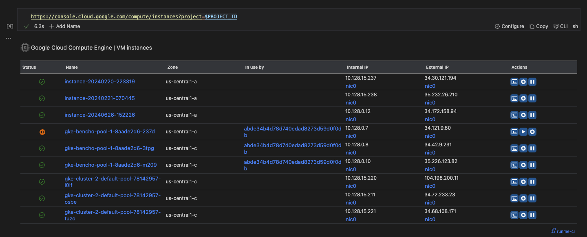

---
runme:
  id: 01J1AM4C0T1S197M3R3MKPXFDB
  version: v3
---


## Runme with Google Cloud

## Prerequisites

#### Via Homebrew

```sh {"id":"01J1ANGXDNJ462THYDNVPWZJTP"}
$ brew install --cask google-cloud-sdk
```

## Setting Up gcloud SDK in Your Notebook

use the [environment vairable](https://docs.runme.dev/getting-started/features#environment-variable-prompts) to set the your project id 

```sh {"id":"01J1AQK0KF874HAGT2HGYG3VFK"}
export PROJECT_ID="runme-ci"
echo "PROJECT_ID set to $PROJECT_ID"
```

To utilize this feature, simply paste a link from the console, specifying the desired project for visualization.

https://console.cloud.google.com/compute/instances?project=$PROJECT_ID

