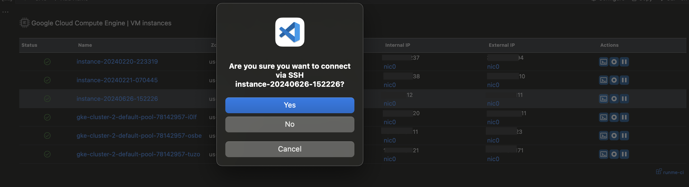
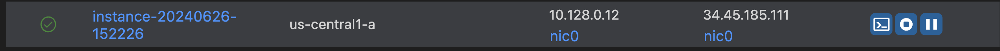
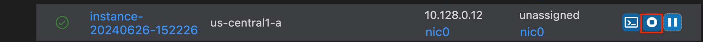
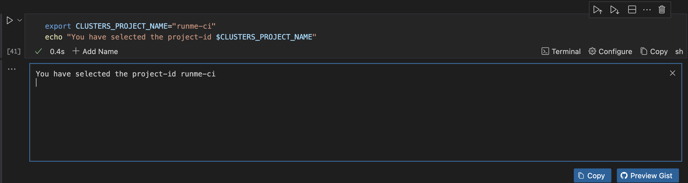
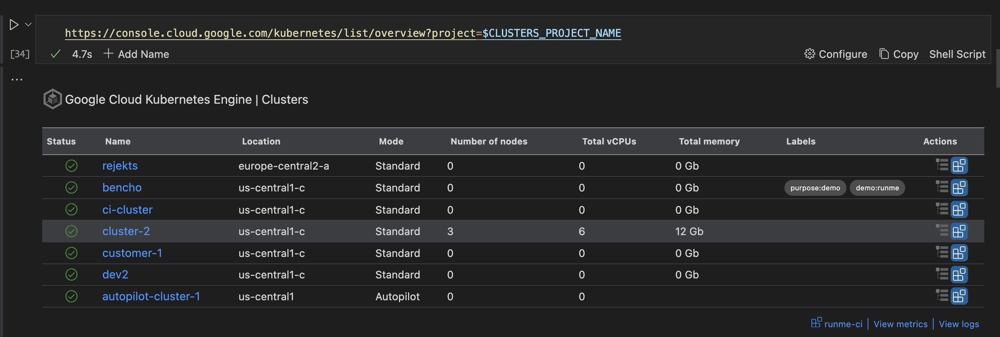
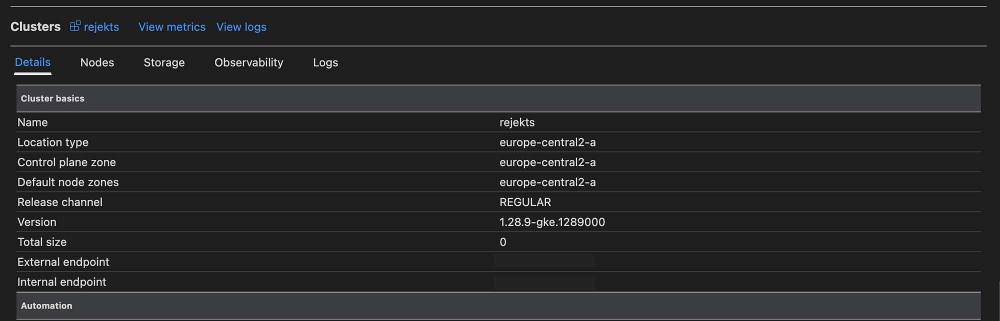

# Runme Cloud Renderers with Google Cloud Platform

Runme introduces Cloud Native Renderers for integrating cloud resources, such as from Google Cloud, directly from your interactive notebook. The integration of Google Cloud Console Views into your Runbook environment provides a unified interface for managing your cloud resources.

This  integration of Google Cloud Console views into your Runbook environment provides a unified interface for managing your resources with Runme Cloud Renderers as you can:

- Effortlessly list, manage, and connect to your cloud virtual machine.
- Perform GKE management tasks within a single interface.
- Simplify your workflow
- Experience faster cloud resource management with Runme, making it easier than ever to handle your Google Cloud Engine and Google Kubernetes Cluster efficiently.

## Prerequisites

**Install Google Cloud SDK**

To interact with Google Cloud resources, you need the Google Cloud SDK. This SDK provides the necessary tools and libraries. Run the command below to install:

```sh {"id":"01J1ANGXDNJ462THYDNVPWZJTP"}
$ brew install --cask google-cloud-sdk
```

For Other platforms Consult [GCP's official docs](https://cloud.google.com/sdk/docs/install)

**Authenticate with Google Cloud**

After installing the SDK, you need to authenticate your account to gain access to your Google Cloud resources. Run the command below to get authenticated:

```sh {"id":"01J1CX6BXBBQ433QSKDNYDX3Q5"}
$ gcloud auth login
```

**Setup default credentials**

Setting up default application credentials allows your applications and tools to access your Google Cloud resources without requiring further authentication prompts. To do this, run the command below:

```sh {"id":"01J1CX90BA6VECCBJAWSWA369W"}
gcloud auth application-default login
```

With Runme's cloud rendering capabilities, you can visualize your Google Cloud dashboard directly within your notebook. Follow the steps below to set up and use this feature.

## Google Compute Engine via Runme's Cloud Render

Google Compute Engine (GCE) is a service that allows users to run virtual machines on Google's infrastructure. It offers a customizable and scalable environment for deploying, managing, and scaling applications.

With Runme's cloud rendering capabilities, you can access and visualize your Google Cloud dashboard directly within your notebook.

This section will walk you through how GCE works in Runme Notebook Renderers.

**Set Your Project ID Using an Environment Variable**

First, set your Google Cloud project ID using an [environment vairable](https://docs.runme.dev/getting-started/features#environment-variable-prompts). This allows you to specify the project you want to work with and visualize in your notebook. To set your project ID, run the command below:

```sh {"id":"01J1AQK0KF874HAGT2HGYG3VFK"}
export PROJECT_ID="runme-ci"
echo "PROJECT_ID set to $PROJECT_ID"
```

**Specify the Project for Visualization**

After setting your project ID, you can now visualize your project.

To see this, you need to paste a link from the console specifying the desired project for visualization, like the link below, and click **run**.

```sh {"id":"01J1CXFZ8AS8VS42KX85A1D7HK"}
https://console.cloud.google.com/compute/instances?project=$PROJECT_ID
```

In this example, `runme-ci` is the project ID.

When you run that code block, you'll be presented with a table displaying your Google Compute Engine instances, similar to your Google Cloud Console.


## Managing Your Virtual Machine

You can easily manage your virtual machine when you access the visualized dashboard within your Runme notebook. Here are the available actions:

1. **SSH into Virtual Machine**

When you SSH into the virtual machine, you gain direct,secure access to your virtual machine, enabling you to perform a wide range of tasks essential fo the management, maintenance and customization of your environment.

To SSH into an virtual machine, do the following:

- Click the SSH button next to the desired machine.


- An interface will ask if you want to SSH into the virtual machine.



- Upon confirmation, another code block will pop up, allowing you to establish an SSH connection to the virtual machine.


2. **Pause an Virtual Machine**

- Click on the pause icon next to the virtual machine you want to pause.


- An interface will appear asking if you want to suspend the virtual machine.
- Click `Yes` or `No` to confirm your choice.

Outcome:

3. **Start Virtual Machine**

- Click the start button next to the virtual machine you want to start.


- An interface will appear asking if you want to start the virtual machine.
- Click `Yes` or `No` to proceed.

Outcome:

the virtual machine is starting


the virtual machine is up



4. **Stop an Virtual Machine**

- Click on the stop button next to the virtual machine you want to stop.



- An interface will pop up asking if you want to stop the virtual machine.
- Click "Yes" or "No" to confirm your action.

The virtual machine has stopped


## Working with Google Kubernetes Cluster

Google Kubernetes Engine(GKE) is a managed Kubernetes service that allows users to deploy, manage, and scale containerized applications using Kubernetes.

Similarly with Runme's cloud rendering, you can view and access your GKE dashboard directly within your Notebook. Follow the steps below to set up and use this feature.

## **List clusters**

Listing cluster in Google Cloud, especially with Google Kubernetes Engine(GKE) provides several benefits such as tracking and managing costs effectively, enhancing team collaboration on cluster management, etc.

To list your Kubernetes clusters, you need to specify your project identifier. Runme makes this easy as it uses the environment variable feature which will prompt you enter your cluster project name which in this case is `runme-ci`. Run the command below to experience this.

```sh {"id":"01J1G0S0Q1X5W8VSDKR0GVH9KF"}
export CLUSTERS_PROJECT_NAME="runme-ci"
echo "You have selected the project-id $CLUSTERS_PROJECT_NAME"
```

This is the output



Now you have configured your project, run the following command to list your clusters:

**Note:** Ensure you have provided a valid value for `project-id`

```sh {"id":"01J1D05NR48FG1QYVD6RDF9KJ5"}
https://console.cloud.google.com/kubernetes/list/overview?project=$CLUSTERS_PROJECT_NAME
```

When the command is run, you will see  a full list of all your Kubernetes cluster.



**View Specific Cluster**

You can also view details of a specific cluster. To do this, click on the actions button beside the cluster which you want to view.


This will create a code block like the one below and automatically run it.

```sh {"background":"false","id":"01J1D07SGQ84ZH1GZSYYVGFTC3"}
https://console.cloud.google.com/kubernetes/clusters/details/europe-central2-a/rejekts/details?project=runme-ci
```

Once the code block is executed, the actions page for that cluster opens up and you can perform any specific action you wish.



If you do not want to go through the process of clicking the button to view details, you can also paste a cluster details link into your Runme code cell and run it. Here is what it looks like

```sh {"id":"01J1D71J5NS0NH2KJS39JHYYS5"}
https://console.cloud.google.com/kubernetes/clusters/details/[location]/[account]/details?project=[project]
```

Be sure to replace the `location`, `account` and `project` with the right credentials to access the details of the cluster.

When this runs, the details dashboard of your cluster will be displayed.


## Feedback and Contribution

We are still developing more features for the Runme Cloud Renderers. If you have feedback on this or new ideas on how to improve this feature, feel free to [reach out to us](https://github.com/stateful/runme?tab=readme-ov-file#feedback).
