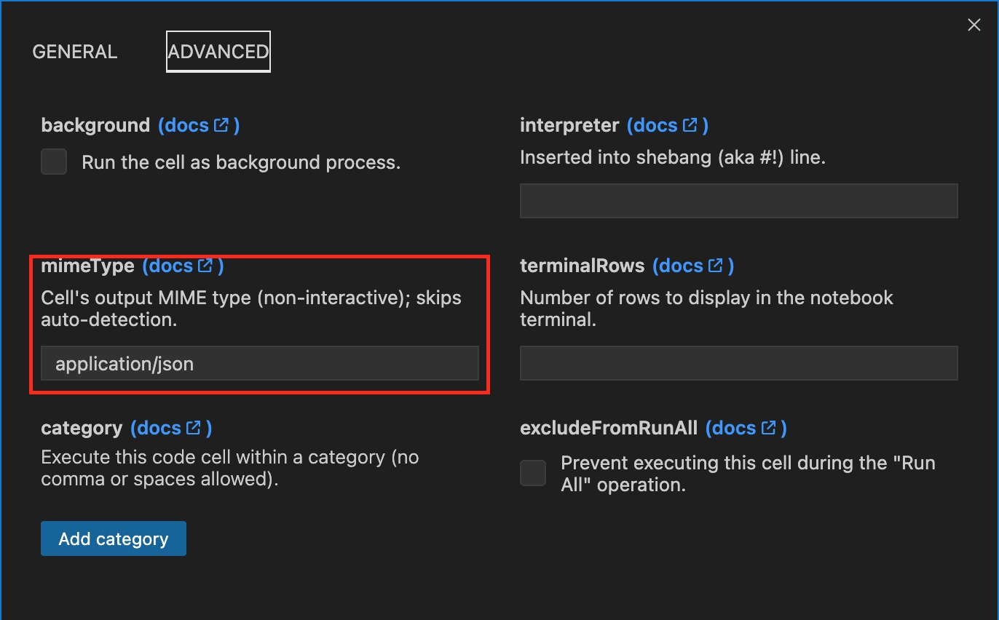
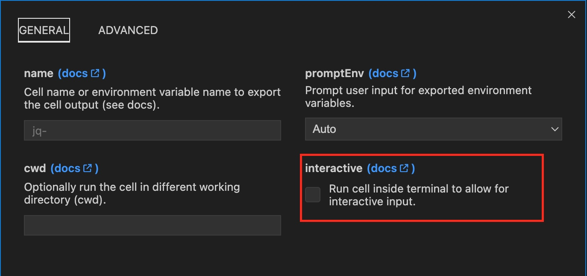
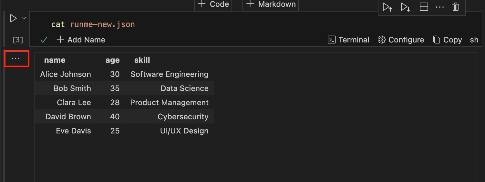
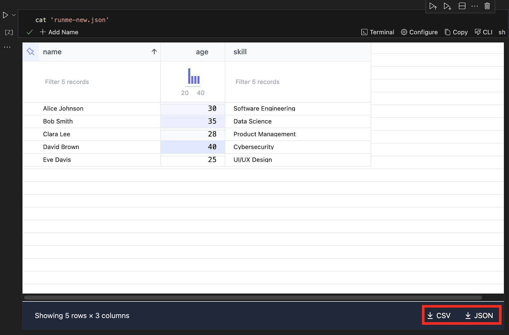

---
runme:
  id: 01J2E98VM6SX1VTPJ524RPCTK4
  version: v3
---

# Data Rendering with JSON and Runme

This section explains how to render your JSON data in your Markdown file using Runme.
Navigating through a large amount of JSON data can be overwhelming. Runme makes this much easier by taking your data and transforming it into an organized format, which can be a tabular arrangement, a flat data grid, or a data summary.

## How It Works

Runme uses two specific features to render JSON Data into human-friendly output.

These features are:

- **Mime Type**
   Multipurpose Internet Mail Extensions(MIME) types are a standard way of indicating a nature and format of a file. Runme has an advanced configuration that allows users to specify the data's [MIME type](../Reference/mime.md).

In this guide, we will work with JSON data to specify that.



However it is important to note that setting the `mimeType` is optional as Runme has an effective auto-detection that detects JSON/CSV files reliably.

- **Interactive Mode**
   The Interactive mode is another feature of Runme that makes rendering JSON data into human-friendly output possible. By default, Runme allows your scripts to run in the interactive mode. This mode enables you to interact with scripts in the output terminal.
   However, you must turn that off to render your JSON data successfully. This can be done with a single click.



Now that we have explored how it works let’s discuss what you need to get started.

## Requirements

To get started with rendering your JSON data, ensure you have the following:

- **Install Runme**

Install the [Runme extension on VS Code](https://marketplace.visualstudio.com/items?itemName=stateful.runme) to enable you access the Runme Notebook on your code editor. You can also set Runme as your [default Markdown viewer](../installation/installrunme#how-to-set-vs-code-as-your-default-markdown-viewer).

- **Install Data Table Renderers**

Install [Data Table Renderers](https://marketplace.visualstudio.com/items?itemName=RandomFractalsInc.vscode-data-table) extension on VS Code.

- **Install Jq**

To install the JSON processor, jq using brew, run the command below

```sh {"id":"01J2E9A4BCXYD11123FRPGB7X8"}
brew install jq
```

## Executing JSON Data Rendering with Bash Script

This section will explore the step-by-step process of executing JSON data rendering with Bash script.

**Step One**

The first step is to create a `.json` file containing the JSON data to be rendered. Next, create a new `README.md` file.

**Step Two**

In your `README.md` file, enter the command below into your Runme cell.

```sh {"id":"01J2E9DZ5T4GTBYMS2B62ARZF3"}
cat <runme-new.json>
```

Ensure to change `<runme-new.json>` to the name of your JSON file.

Now, click the `configuration icon` to configure your cell. In the general configuration dashboard, deactivate the interactive mode.

Next, navigate to the advanced dashboard and enter the MIME type for your file, which is `application/json`. One good thing about Runme is that if you ignore this setting of your MIME type, Runme can automatically detect the file type and fill it in for you. 

**Step Three**

Click on the `run icon` to run the command and watch how your JSON data gets rendered into a human-friendly output.
Here is an example of the output that was obtained.

IMAGES

**Step Four**

If you would love to explore other output types, you only need to click the menu icon (three vertical dots) beside your output.



A small dashboard with several options will pop up. Carry out these actions:

- Click on Change Presentation to change how the data is presented.
- You will be prompted to select how you want to view your data.
- Once that is selected, your output will be displayed in the format above.

<video autoPlay loop muted playsInline controls>
  <source src="/videos/runme-data-rendering.mp4" type="video/mp4" />
  <source src="/videos/runme-data-rendering.webm" type="video/webm" />
</video>

Another great functionality is that you can download your data as a CSV or JSON when you select the `Flat Data Grid` presentation option, as shown in the image below.



## Feedback and Contribution

We are still developing more features for Runme. If you have feedback on this or new ideas for improving this feature, feel free to [contact us](https://github.com/stateful/runme?tab=readme-ov-file#feedback).

## Additional Resources

See more resources on the Runme Renderer feature:

<<<<<<< Updated upstream:docs/integrations/data-rendering.md
- [Manage your Google Cloud Console with Runme Cloud Renderer](https://docs.runme.dev/integrations/cloud-render/gcp)
- [Execute a series of AWS operations in your Runbook](https://docs.runme.dev/integrations/cloud-render/aws)

=======
- [Manage your Google Cloud Console with Runme Cloud Renderer](/guide/cloud-render/gcp)
- [Execute a series of AWS operations in your Runbook](/guide/cloud-render/aws)
>>>>>>> Stashed changes:docs/configuration/output-rendering.md
