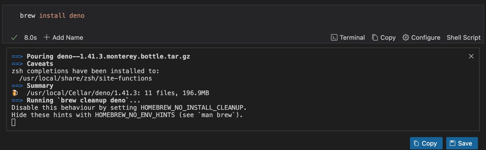
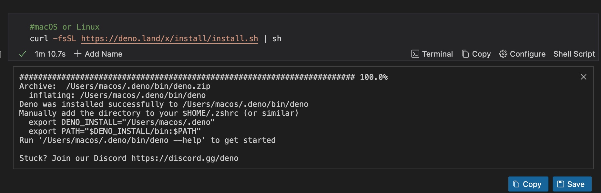
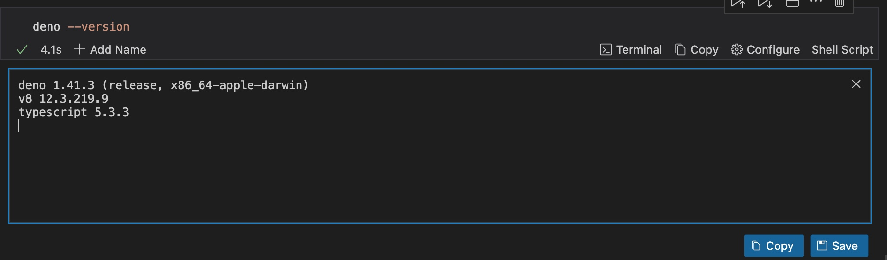
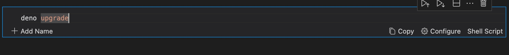
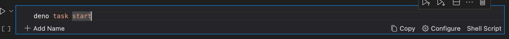
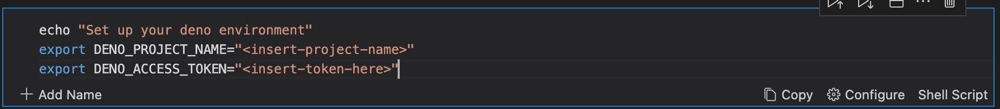

Did you know that you can Deploy your applications to the Deno cloud right inside your Markdown file without needing extra configurations?

Runme makes this possible in a few easy steps.

In this section, we will provide you with a step-by-step guide on how to achieve that.

We have created an example in the `fresh` folder that sets up a Fresh service with Deno. You can manually check out this example by [opening it with Runme](https://runme.dev/api/runme?repository=https%3A%2F%2Fgithub.com%2Fstateful%2Fvscode-runme.git&fileToOpen=examples%2Ffresh%2FREADME.md).

## Prerequisite

To follow up on this section, you must first install Deno. You can install Deno via two options with the Runme extension on VS Code.

1. Install Deno via Homebrew on macOS:

Install Deno via the use of curl:

2. Confirm if the installation was successful

3. If you would love to update a previously installed version of Deno, run the command below:

## Setting up Environment Variables

Once Deno is installed, setting up your [environment variables](../getting-started/features#environment-variable-prompts) is next. This will allow you to configure your application without hardcoding values into your code, making automation much easier.

## Start Your Application Development

To start your development, use the command below

Now, open the project in a browser:

This will watch the project directory and restart as necessary.

## Deploy Your Application

For this application, we will be using [Deno deploy](https://deno.com/deploy) a serverless edge first JavaScript hosting service for deployment.

To deploy this project, you must have `deployctl` (the command line tool for Deno Deploy) installed on your system. To install, please run:

Once installed successfully, create a new access token and export it into your environment:

Now, you can run a preview deployment and subsequently promote it to production via:

You have successfully deployed your application to Deno cloud with Runme. However, this is just one of the various ways you can integrate Runme with your tools. To learn more, explore our [guide section](../guide/index.md).
