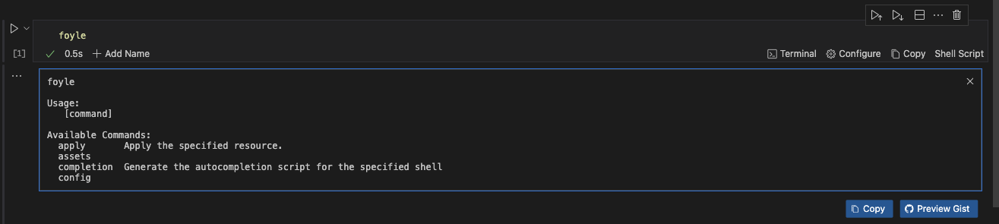
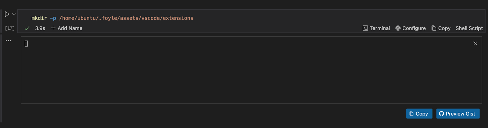
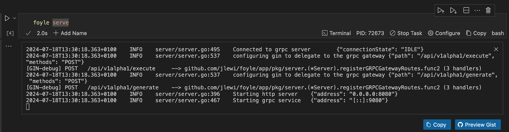

---
runme:
  id: 01J330CF5MW7GYJ2GQTQBM15WW
  version: v3
---

# How to Use Foyle with Runme

Foyle is a project designed to build agents that assist software developers in deploying and operating software by moving software development operations from the shell to a literate environment.

​It utilizes VS Code and integrates with Runme to provide users with a nice frontend for software development operations. This guide will explore how to perform operations with Foyle in your Runme Notebook.

## Installation

You need to follow up on this installation section to get started with this tutorial.

**Install Runme**

Install the [Runme extension](https://marketplace.visualstudio.com/items?itemName=stateful.runme) in your VS Code editor and make it your [default Markdown viewer](../installation/installrunme#how-to-set-vs-code-as-your-default-markdown-viewer).

**Install Foyle**

To install Foyle, do the following

- **Download the Binary**

The first step to installing Foyle is to download the binary. You can download the latest release from the [releases page](https://github.com/jlewi/foyle/releases). In this guide, we will download the Foyle application package for Linux. To do that, run the command below.

```sh {"id":"01J330D58TDAQZ8J3DJAP4K111"}
wget https://github.com/jlewi/foyle/releases/download/v0.0.14/foyle_0.0.14_linux_amd64
```

This command downloads the specified version of the Foyle binary for Linux, allowing you to install and use Foyle on your system.

When successfully executed, you will get an output similar to the image below.


However, if you install Foyle on Mac, you may need to remove the quarantine attribute from the binary. To do that, run the command below.

```sh {"id":"01J330HTHQKQ12RVKN5BVBM8NE"}
xattr -d com.apple.quarantine /path/to/foyle
```

- **Move the Executable**

The next step is to move the executable to the bin directory. This action makes the application easily accessible from the command line without specifying its full path every time you run it. To do this, run the command below.

```sh {"id":"01J330JKQ8RDCC8YCTTBWWB9EQ"}
sudo mv foyle_0.0.14_linux_amd64 /usr/local/bin/foyle
```

- **Give Executable Permissions**

To give Foyle executable permissions, run the command below

```sh {"id":"01J330MAHP2QBZD5XYDS7PKG87"}
sudo chmod +x /usr/local/bin/foyle
```

- **Check if Foyle is Installed**

To check if Foyle is correctly installed on your local machine, run the command below

```sh {"id":"01J330NJEGB02JJSXFEKRVJ8PA"}
foyle
```

This command should display as seen in the image below if Foyle is installed.



- **Create a Directory Path for Foyle**

Creating the `.foyle/assets/vscode/extensions` directory is important as it ensures that Foyle’s assets and configuration files are well-stored and organized. It also ensures proper integration with VS Code by managing VS Code extensions and maintaining consistency across sessions.

To create a directory path for Foyle, run the command below

```sh {"id":"01J330SNEAJGRB7JKKBYEJ1BM9"}
mkdir -p /home/ubuntu/.foyle/assets/vscode/extensions
```

This command will create the entire directory path `/home/ubuntu/.foyle/assets/vscode/extensions` if it doesn't already exist.



## Setting Up Foyle

After successfully installing Foyle, the next step is to set it up. This section will break down the steps required to do so.

### Configure Your OpenAPI Key

To perform this action, you need an API key. If you do not have one, go to [OpenAI](https://openai.com/) to obtain one.

Once you have gotten your key, run the command below.

```sh {"id":"01J3311MR9WFWKQG2BZ6CS2MNC"}
foyle config set openai.apiKeyFile=/path/to/openai/apikey
```


### Start the Server

Run the command below to start the Foyle server on your local machine. However, you must ensure your API Key is in the directory where this command will run.

If it isn’t, you can set the directory of your code cell to the directory where your API Key is located using the [CWD feature of Runme](../configuration/cell-level#cells-current-working-directory).

```sh {"id":"01J331ERREM6TZ2VCVES792H65"}
foyle serve
```

This command should start Foyle in the background. To make this run in the background without disrupting your activities, activate the [background task](../getting-started/features#background-task) mode of your cell. Once that is done, run the cell, and you will get an output similar to the image below.



By default, Foyle uses port `8080` for the HTTP server and port `9080` for gRPC. You can configure this by running the command below if you would love to use different ports.

```sh {"id":"01J331M1RFEST6592A558A8G3S"}
foyle config set server.httpPort=<YOUR HTTP PORT>
foyle config set server.grpcPort=<YOUR GRPC PORT>
```

**Confirm Foyle Address**

If you would love to confirm your Foyle Address in VS Code, do the following.
- Open the VSCode setting palette
- Search for `Runme: Foyle Address`
- Set the address to `localhost:${GRPC_PORT}`. By default, the port is `9080`. If you set a non-default value, it will be the value of `server.grpcPort`


