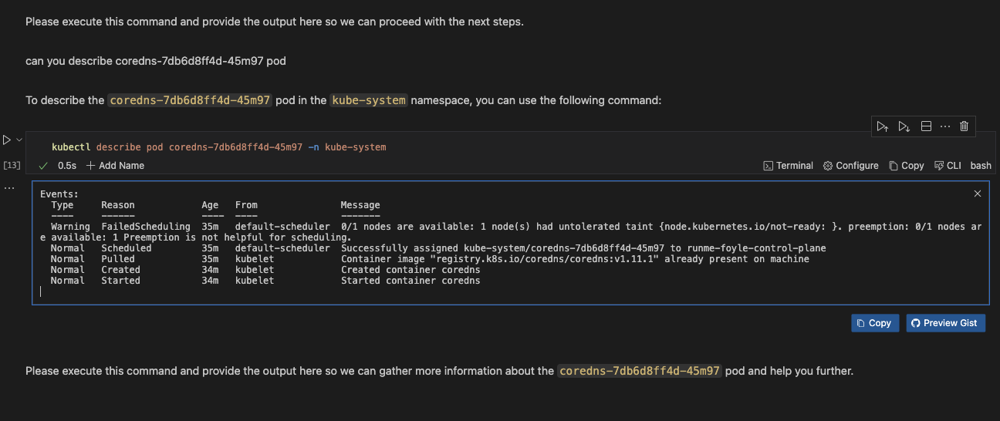

---
runme:
  id: 01J330CF5MW7GYJ2GQTQBM15WW
  version: v3
---

# How to Use Foyle AI with Runme

This guide shows you how to use Runme Notebook to run and execute commands and prompts. By integrating [Foyle](https://foyle.io/), an AI assistant, you can execute cells containing shell commands or Markdown. However, to perform these actions, Foyle works within the Runme Notebook to enable you to input prompts and display the generated output directly within the Notebook.

This makes it easy to add and run commands, as Foyle can automatically create and execute the necessary cells based on your input. With Runme's interactive notebook, you can perform these operations and view your completed tasks.

## Installation

To get started, ensure you have the following installed:

- **Runme Extension**

To access the Runme Notebook, install the [Runme extension](https://marketplace.visualstudio.com/items?itemName=stateful.runme) in your VS Code editor. You can also set Runme as your [default Markdown viewer](../installation/installrunme#how-to-set-vs-code-as-your-default-markdown-viewer).

- **Install Foyle**

To install Foyle, follow the steps as instructed [here](https://github.com/jlewi/foyle/releases).

## Setting Up Foyle with Runme

After successfully installing Foyle, the next step is to set it up. This section will break down the setup process.

1. **Configure Your OpenAPI Key**

To kickstart setting up Foyle on your local machine, you will need to configure your OpenAPI key. This will give you access to work with Foyle. Go to [OpenAI](https://openai.com/) to obtain your unique API key.

Once you have gotten your key, save it in a plain text file and run the command below.

```sh {"id":"01J3311MR9WFWKQG2BZ6CS2MNC"}
foyle config set openai.apiKeyFile=/path/to/openai/apikey
```


2. **Start the Server**

Run the command below to start the Foyle server on your local machine. However, you must ensure your API Key is in the directory where this command will run. If it isn’t, you can set the directory of your code cell to the directory where your API Key is located using the [CWD feature of Runme](../configuration/cell-level#cells-current-working-directory).

```sh {"background":"true","id":"01J331ERREM6TZ2VCVES792H65"}
foyle serve
```

This command should start Foyle in the background. To make it run without disrupting your activities, activate your cell's [background task](../getting-started/features#background-task) mode. This feature will make Foyle run as a background task without interrupting your progress.

Once that is done, run the cell, and you will get an output similar to the image below.


By default, Foyle uses port `8080` for the HTTP server and port `9080` for gRPC. You can configure this by running the command below if you would love to use different ports.

```sh {"id":"01J331M1RFEST6592A558A8G3S"}
export FOYLE_HTTP_PORT=YOUR HTTP PORT
export FOYLE_GRCP_PORT=YOUR GRPC PORT
foyle config set server.httpPort=$FOYLE_HTTP_PORT
foyle config set server.grpcPort=$FOYLE_GRPC_PORT
```

3. **Confirm Foyle's Address**

If you would love to confirm your Foyle Address in VS Code, do the following.

- Open the VS Code setting palette
- Search for `Runme: Foyle Address`
- Set the address to `localhost:${GRPC_PORT}`. By default, the port is `9080`. If you set a non-default value, it will be the value of `server.grpcPort`


## Running Foyle Operations with Runme

Now that Foyle has been successfully installed and set up in your Runme Notebook, we can proceed to test it out by performing some operations, such as asking it questions like we would ask an AI tool.

In this section, we will be performing several operations with Foyle, such as setting up a kind cluster, getting a list of all namespaces in a cluster, and listing and describing pods.

### Running a Prompt

With this integration, you can ask a question using Foyle within the Notebook to generate a response. Remember, Foyle allows you to add cells and execute commands within a Notebook.

In the example below, we will demonstrate “**How to set up a kind cluster**” using Foyle in our Runme Interactive Notebook.

To do this, first, create a new Markdown cell in your Markdown file and type your questions. For instance, in the video below, we will ask Foyle, "How do I set up a kind cluster?"

Foyle will answer the question below.

<video autoPlay loop muted playsInline controls>
  <source src="/videos/runme-foyle-example.mp4" type="video/mp4" />
  <source src="/videos/runme-foyle-example.webm" type="video/webm" />
  <source src="../../static/videos/runme-foyle-example.mp4" type="video/mp4" />
</video>

### Executing a Command

When you enter a command in the Notebook, you can run it to get a response. Foyle processes the command and displays the response in the Notebook.

To run the question and get Foyle to answer, press `shift + command + p`. This will open a dashboard with several options. Select **Generate cells using the Foyle assistant**.

In the video below, we prompt Foyle to list all pods. Foyle returns the command, which you can run in the Markdown file to get the list of all pods.

<video autoPlay loop muted playsInline controls>
  <source src="/videos/runme-foyle-command.mp4" type="video/mp4" />
  <source src="/videos/runme-foyle-command.webm" type="video/webm" />
  <source src="../../static/videos/runme-foyle-command.mp4" type="video/mp4" />
</video>

### Generate Output Based on Previous Command

Additionally, you can also use Foyle to generate output based on your previous commands. Foyle will follow the events from your previous commands or output and return the result in the Notebook.

In the image below, we are asking Foyle to describe a pod from the list of pods we got in the example above.



## Feedback and Contribution

If you have any tool or project you would like to see integrated with Runme, feel free to [contact us](https://github.com/stateful/runme?tab=readme-ov-file#feedback) with your idea. We will be glad to test it out.


