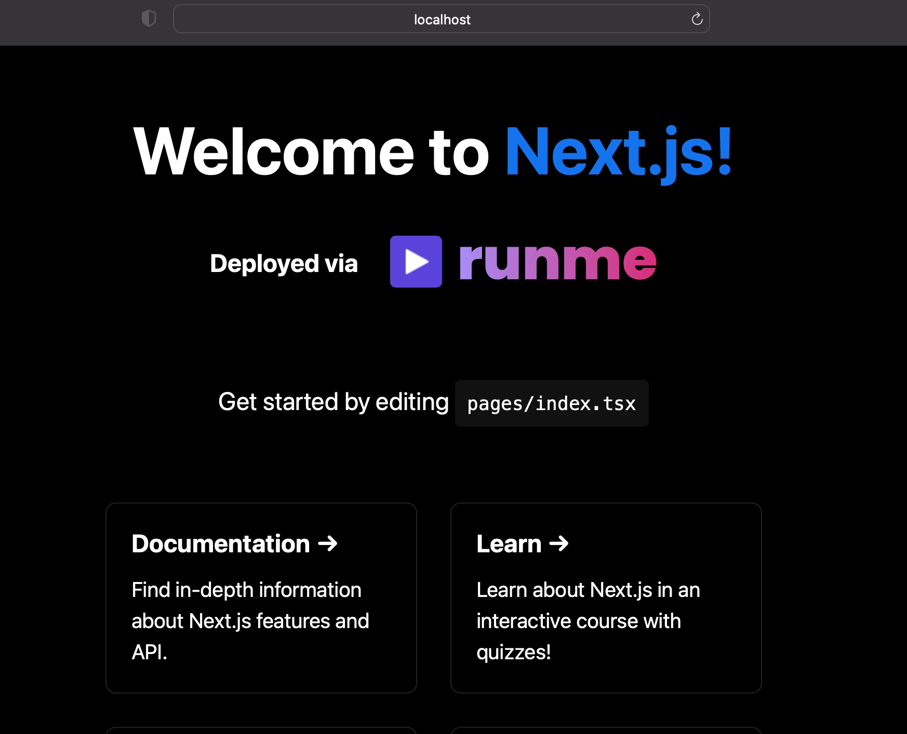
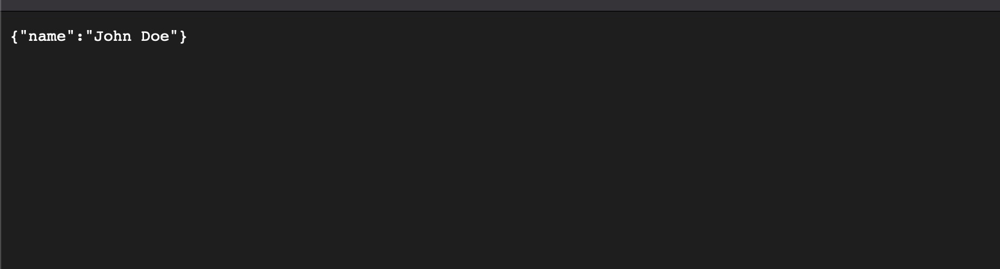
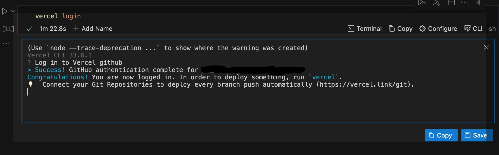
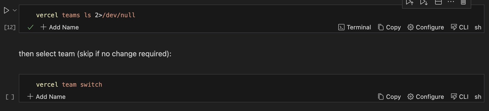
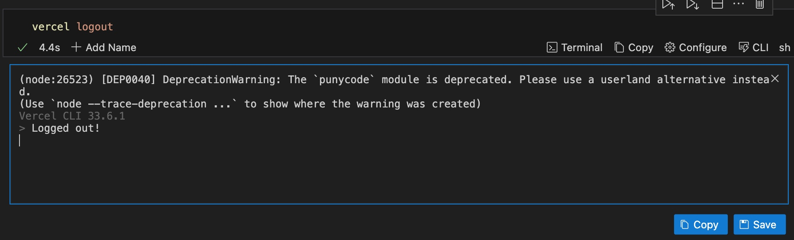

Runme allows you to define processes for creating, managing, and deploying your applications. This includes step-by-step runbooks for both your operational and development tasks, ensuring clear documentation for future reference.

In this guide, we will walk you through automating a [Next.js](https://nextjs.org/) deployment on Vercel using Runme.

For the purpose of this guide, we have created an existing Next.js project in the `vercel` sub-folder in our [example repo](https://runme.dev/api/runme?repository=https%3A%2F%2Fgithub.com%2Fstateful%2Fvscode-runme.git&fileToOpen=examples%2Fvercel%2FREADME.md). Simply clone this repo and open it with your Runme extension on VS Code.

## Setting up your Environment

Next, set up your Next.js environment. Follow the steps below to set up a Next.js application and prepare for deployment:

1. Install all dependencies

To install all dependencies in the repo, enter the command below and in your Runme cell and click the run button at the left side of your screen. See sample below:

2. Run the development server

To run the development server, run the code below in your Markdown file

3. Open the local host on your browser to see the result

Your browser will automatically open a new page.

You can start editing the page by modifying `pages/index.tsx`. The page auto-updates as you edit the file.

4. Access API endpoints

[API routes](https://nextjs.org/docs/api-routes/introduction) can be accessed at http://localhost:3000/api/hello. This endpoint can be edited in `pages/api/hello.ts`.

The API page will open; you will see this image below in your browser.

The `pages/api` directory is mapped to `/api/*`. Files in this directory are treated as [API routes](https://nextjs.org/docs/api-routes/introduction) instead of React pages.

## Deploy Your Next.js Application on Vercel

[Vercel](https://vercel.com/) provides a smooth and easy way to host or deploy Next.js applications on the cloud. We will be deploying our Next.js application on Vervel.

To follow the steps below, ensure you have a [Vercel account](https://www.google.com/url?sa=t&rct=j&q=&esrc=s&source=web&cd=&cad=rja&uact=8&ved=2ahUKEwing56Jr4CFAxVvQEEAHStnDz0QFnoECAYQAQ&url=https%3A%2F%2Fvercel.com%2Flogin&usg=AOvVaw0MibnET74ntlyFxLY7HHdH&opi=89978449).

Let’s get into it!

1. Install Vercel CLI with Runme.

2. To log in to Vercel, click the run button beside the code block. A new view will open in your Runme terminal.

3. Select your team

You have successfully logged into your Vercel account. Now, it is time to select your team and invite them to the project.

To do this, use the command below. If you want to switch your team, use the command shown in the image below.

4. List the projects to be deployed.

Remember, cells can capture the output of commands in non-interactive mode!

This can be used to get a list of the user's current registered projects with the Vercel platform.

5. Set a name and link our local directory to the project.

The Runme environment prompt makes setting up a name for your project easier.

Additionally, you can link your directory to a project and kick off a preview deployment. See the image below for a better understanding.

6. Log out

Now, you have successfully deployed your application on Vercel. You can log out using the command in the image below:

Runme automatically saves every generated output into separate files using a feature called [session outputs](../configuration/auto-save#session-outputs). These files are conveniently timestamped, allowing you to easily track when each output was generated. See the [Autosave feature](../configuration/auto-save) to learn how to enable autosave for your outputs.
