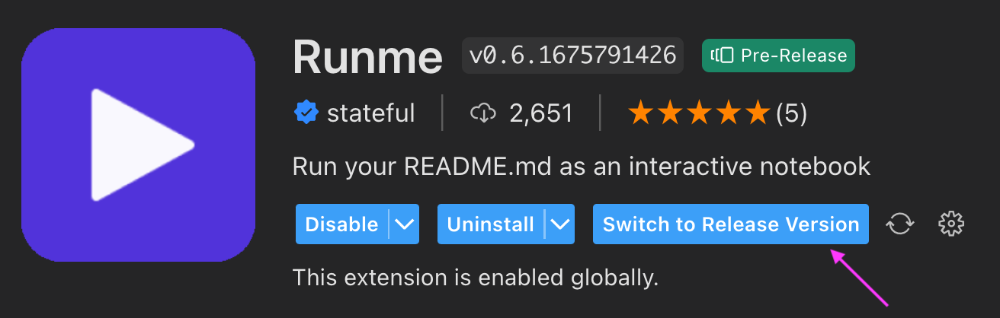

# Open Source

We are committed to building Runme in the open and hope you get involved!

## Project

Runme lives in three repositories on Github:

* The[ runme.dev website](http://runme.dev)
* The[ Runme repo (CLI and execution engine)](https://github.com/stateful/runme)
* The[ Runme VS Code extension](https://github.com/stateful/vscode-runme)

You can also follow our[ kanban project](https://github.com/orgs/stateful/projects/8) to see in progress development.

## Pre-release

If you want to test drive cutting-edge features, Runme offers regular edge releases you can simply switch channels from the ⚙️ (gear) icon's "Switch to Pre-Release/Release" respectively.

## Getting help

We encourage you to log issues in Github, or join our Discord - we look forward to hearing what you have to say.

## Known limitations

* Be cautious with environment variables interleaved within code blocks. The stateful execution of the notebooks (shell/bash-only; no PowerShell on Windows yet) leverages a naive implementation where the VS Code extension prompts for ENV var values and attempts to expand them. In essence, it does not match an interactive bash/shell session (yet).
* We continue experimenting with aspects of user/developer experience including the passing of information/variables from cell to cell, ENV var handling that more closely matches shell a session and more robust markdown handling.
* Don’t be alarmed to not see front matter in your notebook view.