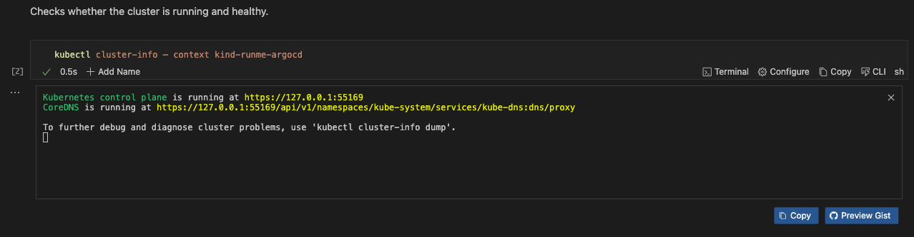
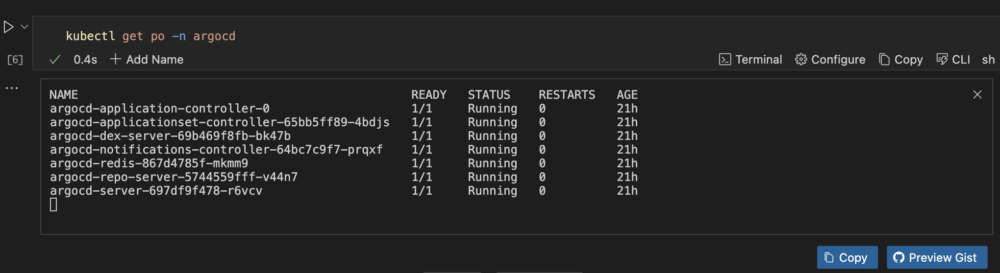
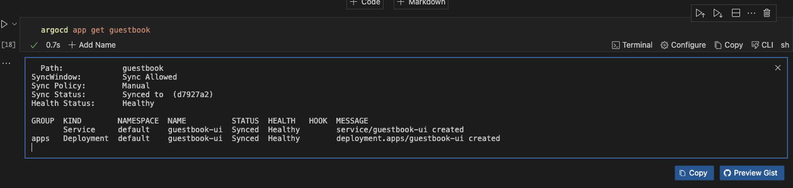
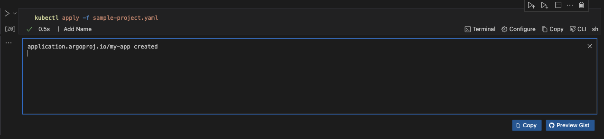

---
runme:
  id: 01J0QP74QNFG58ANB2DYKDGEZ6
  version: v3
---

# Advanced Guide to Argo CD and Runme

Our previous guide provided a detailed tutorial on [deploying and managing applications with ArgoCD and Runme.](https://docs.runme.dev/guide/agrocd)

In this guide, we will take it a step higher by providing an advanced tutorial on how to use Argo CD with the Runme extension in VS Code. The best part of this integration is that everything can be done right inside your Markdown file without switching between terminals.

## **Prerequisites**

To follow up on this tutorial, ensure you have the following:

> 💡 Ensure you have installed the necessary tools as indicated in the [beginner guide](https://docs.runme.dev/guide/agrocd#prerequisites)

**Basic Requirement**

- Basic familiarity with YAML and Kubernetes resource definitions
- **Runme Extension**: Install the [Runme extension](https://marketplace.visualstudio.com/items?itemName=stateful.runme) in your VS Code editor and set it as your [default Markdown viewer](https://docs.runme.dev/installation/vscode#how-to-set-vs-code-as-your-default-markdown-viewer).

**Clone Our Repository**

- **Clone Repository**: We have provided an example repository to help you follow this tutorial. You can clone the [repository here](https://github.com/stateful/blog-examples/tree/main/cloud-native).

```sh {"id":"01J0TF9A888ZBTPEJZGRBPPCVW"}
git clone https://github.com/stateful/blog-examples/tree/main/cloud-native
```

**Installation**

Run the following commands to install the necessary tools and set up your environment:

```sh {"id":"01J0TF9A888ZBTPEJZGTBE987F"}
/bin/bash -c "$(curl -fsSL https://raw.githubusercontent.com/Homebrew/install/HEAD/install.sh)"
brew install git
brew install kind
brew install docker
brew install argocd
brew install yq
```

The command above installs `brew` and `git,` creates a local Kubernetes Cluster using [kind](https://kind.sigs.k8s.io/)

💡 For your kind cluster to run, you need to have docker running.

## **Setting Up Your Cluster**

To proceed with this tutorial, you need to set up your Kubernetes cluster. This is an important step as it ensures that ArgoCD can effectively maintain the desired state of your application and perform continuous delivery.

The command below helps you do that.

```sh {"id":"01J0QP7HM4HB9NY43B10CQYNDK"}
kind create cluster --name runme-argocd
```

Run the command below to inspect the cluster to ensure it is running and healthy.

```sh {"id":"01J0TG40SSNCDSW1A0F4Q0K87Y"}
kubectl cluster-info — context kind-runme-argocd
```



To inspect namespaces, execute the command below

```sh {"id":"01J0QPCQXAWZ0ZG837CEKH1CA1"}
kubectl get ns
```

To create a new namespace, execute the command below

```sh {"id":"01J0QPDF85VJKWXB4SB4HTBJDF"}
kubectl create namespace argocd
```

## Install Argo CD in Kubernetes Cluster

After setting up your cluster, the next step is to install Argo CD in your Kubernetes cluster. To do this, run the command below.

```sh {"id":"01J0R7GVV6AH9639D5A0KH0CWR"}
kubectl apply -n argocd -f https://raw.githubusercontent.com/argoproj/argo-cd/stable/manifests/install.yaml
```

Get Argo CD Pods in the Argo CD namespace

```sh {"id":"01J0R7H9M56S007HYKPASR2639"}
kubectl get po -n argocd
```



Port forwarding an Argo CD Server is a practical and secure way to access the Argo CD web UI for setup, development, and general use without exposing it to external networks.

To do this, run the command below. You can run your code cell as a [background process](/configuration/cell-level#long-running-processes). This feature enables you to run tasks in the background while continuing with your other tasks.

```sh {"background":"true","id":"01J0R8FX97QQR7ME2DH3C54C6E"}
kubectl port-forward svc/argocd-server -n argocd 8080:443
```


**Retrieve Initial Admin Password**

To access and manage Argo CD via its web UI, you need your admin credentials. To retrieve this password, run the command below.

```sh {"id":"01J0R8GGMCBAYYEMEG7K4WSE2Q"}
kubectl -n argocd get secret argocd-initial-admin-secret -o jsonpath="{.data.password}" | base64 --decode
```

### Login to Argo CD CLI

Now that you have successfully retrieved your login credentials, you can log in to your Argo CD CLI. To do that, run the command below.

```sh {"id":"01J0V0PQ2TA2MC9A2JB92RGQPF"}
argocd login <ARGOCD_SERVER> --username admin --password <retrieved-password> --insecure
```

```sh {"id":"01J0R8H2WGKEHE1J2J8EYHBTW7"}
argocd login localhost:8080 --username admin --password GS66Sw8YrJ7bn1I- --insecure

```

## **Deploy an Application Using Argo CD**

After logging into your Argo CD CLI, you can now easily deploy an application using the functionalities of Argo CD and Runme right inside your Markdown file. This section walks you through the step-by-step process of achieving this.

To proceed, you need to create a project. If you haven’t created one, run the command below to create one on the go.

```sh {"id":"01J0R8JSF8RTE86JN7SXFQX4Y9"}
argocd proj create my-project
```

Register a Repository

The next step is to register your repository. This is an important step as it allows Argo CD to access and monitor the repository hosting your application configurations.

To register your repository, execute the command below.

```sh {"id":"01J0RBRQ824D1SVC4X9Z4GXPMV"}
argocd repo add https://github.com/stateful/blog-examples.git
```

(Add the flag `--username` myuser `--password` or SSH key if you're behind authentication.)

### Create an Application:

After registering your repository, the next step is to create an application. To do so, run the command below. This command creates an Argo CD application named `guestbook`

```sh {"id":"01J0TQAWCHF87ZDKPHKNCNFVR8"}
argocd app create guestbook --repo https://github.com/argoproj/argocd-example-apps.git --path guestbook --dest-namespace default --dest-server https://kubernetes.default.svc --directory-recurse
```

### Sync Application

You can now sync your application. To do so, run the command below. The command is used to synchronize the state of the guestbook application managed by Argo CD

```sh {"id":"01J0RECRAKE385EBM7R62GYF3N"}
argocd app sync guestbook
```

### Check Status

To check the status of your application, run the command below.

```sh {"id":"01J0REE4N5XT06VH48M2SV2ARC"}
argocd app get guestbook
```



## **CLI Operations**

The Argo CD CLI provides a set of operations to manage applications, repositories, and other resources in Argo CD. In this section, we will discuss some of the key operations you can perform using the Argo CD CLI.

### Argo CD History

To view the deployment history of your application, you can use the `argocd app history` command. This command provides a list of all the revisions that have been deployed, along with timestamps, commit messages, and other relevant details.

```bash {"id":"01J0TF9A888ZBTPEJZGVZRFF28"}
argocd app history guestbook
```

### Argo CD Rollback

Argo CD maintains a history of application deployments, allowing you to roll back to a previous state if needed. To list the history:

```sh {"id":"01J0TF9A888ZBTPEJZGZHDXGNZ"}
argocd app history guestbook
```

If you would love to rollback to a specific revision, run this command instead.

```sh {"id":"01J0TF9A888ZBTPEJZH14W89P0"}
argocd app rollback guestbook <1>
```

Replace `<REVISION>` with the desired revision number from the history.

## **Managing Repositories with Argo CD CLI**

It is possible to manage your repositories with Argo CD CLI. Here are some ways to do that.

**Add a Repository**

To register a new public repository, run the command below.

```sh {"id":"01J0TF9A888ZBTPEJZH2648SDC"}
argocd repo add https://github.com/my-org/my-repo.git
```

**Update the Repository**

If you would love to change the repository URL and update authentication credentials, run the command below.

```sh {"id":"01J0TF9A89KN0GBESXMNG6K3PR"}
argocd repo update https://github.com/my-org/my-repo.git --url https://github.com/my-org/new-repo-url.git
argocd repo update https://github.com/my-org/new-repo-url.git --username newuser --password newpass
```

**Remove the Repository**:

To unregister the repository when it's no longer needed, run the command below.

```sh {"id":"01J0TF9A89KN0GBESXMR266BWR"}
argocd repo rm https://github.com/my-org/new-repo-url.git
```

### Accessing Application Logs with Argo CD CLI

You can also view the logs of applications managed by Argo CD. This section discusses how to do so.

**View All Logs**

To get a broad overview of the application, run the command below. This will give you all the logs associated with the application.

```sh {"id":"01J0TF9A89KN0GBESXMTV8QV04"}
argocd app logs guestbook
```

**Filter by Pod**

If you have a pod that is experiencing issues, you can use the filter-by-pod feature to view the logs associated with that pod. To do this, run the command below.

```sh {"id":"01J0TF9A89KN0GBESXMW3Z0QT9"}
argocd app logs my-app --pod my-app-pod-12345
```

**Filter by Container**

To narrow down to the logs of a particular container within that pod, run the command below.

```sh {"id":"01J0TF9A89KN0GBESXMZZX8W0D"}
argocd app logs my-app --pod my-app-pod-12345 --container my-container
```

**Stream Logs**

To continuously monitor the logs to observe real-time application behavior, run the command below.

```sh {"id":"01J0TF9A89KN0GBESXN2BFXZB8"}
argocd app logs guestbook --follow
```

**Tail Specific Logs**

To retrieve and follow the last 100 lines of logs for a focused troubleshooting session, run the command below.

```sh {"id":"01J0TF9A89KN0GBESXN30NM9WH"}
argocd app logs my-app --tail 100 --follow
```

### Customizing Argo CD

Customizing Argo CD can be beneficial as it allows you to tailor your Argo CD to meet your organization's specific needs and improve security and user experience.

In this section, we will walk you through the steps involved in customizing Argo CD.

**Step One: Define an Application with CRD**

To do this, you need to create a YAML file for the application.

```sh {"id":"01J0TF9A89KN0GBESXN48STWQR"}
cat << EOF > sample-project.yaml
apiVersion: argoproj.io/v1alpha1
kind: Application
metadata:
  name: my-app
  namespace: argocd
spec:
  project: default
  source:
    repoURL: https://github.com/stateful/blog-examples.git
    path: cloud-native
    targetRevision: HEAD
  destination:
    server: https://kubernetes.default.svc
    namespace: default
  syncPolicy:
    automated:
      prune: true
      selfHeal: true

EOF

```

**Step Two: Apply the Application CRD**

Run the command below to apply the application CRD you created in your YAML file.

```sh {"id":"01J0TF9A89KN0GBESXN5H4NFQ7"}
kubectl apply -f sample-project.yaml
```



**Step Three: Configure a Plugin**

Now, add a custom plugin to `argocd-cm`.

```sh {"id":"01J0TF9A89KN0GBESXN61QE8VK"}
cat << EOF > runme-argocd-cm.yaml
apiVersion: v1
kind: ConfigMap
metadata:
  name: runme-argocd-cm
  namespace: argocd
data:
  configManagementPlugins: |
    - name: my-plugin
      init:
        command: ["/bin/sh", "-c"]
        args: ["echo initializing..."]
      generate:
        command: ["/bin/sh", "-c"]
        args: ["echo generating manifests..."]
EOF
```

**Step Four: Apply the Plugin Configuration**

Apply the plugin configuration you created.

```sh {"id":"01J0TF9A89KN0GBESXN7T1EEJ6"}
kubectl apply -f runme-argocd-cm.yaml

```

**Step Five: Define an Application Using the Plugin**

This file helps you do this.

```sh {"id":"01J0TF9A89KN0GBESXN817NCCD"}
cat << EOF > runme-argocd-plugins.yaml
apiVersion: argoproj.io/v1alpha1
kind: Application
metadata:
  name: my-run-with-plugin
  namespace: argocd
spec:
  project: default
  source:
    repoURL: https://github.com/stateful/blog-examples.git
    path: cloud-native
    plugin:
      name: my-plugin
  destination:
    server: https://kubernetes.default.svc
    namespace: default
  syncPolicy:
    automated:
      prune: true
      selfHeal: true
EOF

```

**Step Six: Apply the Application Configuration**

Apply the application configuration you created earlier.

```sh {"id":"01J0TF9A89KN0GBESXN8Y7FDNQ"}
kubectl apply -f runme-argocd-plugins.yaml
```

### Scaling and Performance Tuning

As Argo CD is increasingly adopted in large-scale environments, ensuring optimal performance and scalability becomes critical. Proper configuration and monitoring can significantly enhance Argo CD's efficiency, reliability, and responsiveness.

This section covers strategies for optimizing Argo CD for large-scale deployments, performance monitoring, tuning tips, and setting up disaster recovery procedures.

**Optimizing Argo CD for Large-Scale Deployments**

Large-scale deployments often involve managing hundreds or thousands of applications, which can place considerable demands on Argo CD. Here are key practices for optimizing Argo CD for such environments:

**Resource Allocation**

Ensure that the Argo CD components (e.g., server, controller, repo server, and application controller) have adequate CPU and memory resources. This can be configured in your Helm chart or directly in the Kubernetes manifests.

```yaml {"id":"01J29B8QWGEHQT9D4F7CDEP9FN"}
controller:
  resources:
    requests:
      memory: "512Mi"
      cpu: "250m"
    limits:
      memory: "1Gi"
      cpu: "500m"
repoServer:
  resources:
    requests:
      memory: "256Mi"
      cpu: "125m"
    limits:
      memory: "512Mi"
      cpu: "250m"
server:
  resources:
    requests:
      memory: "256Mi"
      cpu: "125m"
    limits:
      memory: "512Mi"
      cpu: "250m"
```

**Repository Caching**

Enable and configure repository caching to reduce the load on the repo server and speed up application syncing.

Example configuration:

```sh {"id":"01J0TF9A89KN0GBESXNBTG0ARH"}
cat << EOF > runme-argocd-plugins1.yaml
  data:
    repository.credentials: |
      - url: https://github.com/my-org/my-repo.git
        cacheDuration: 30m
EOF
```

```sh {"id":"01J0TWDFWAA01HWKDDY8MAM2CP"}
yq eval-all 'select(fileIndex == 0) * select(fileIndex == 1)' argocd-cm.yaml runme-argocd-plugins1.yaml > merged.yaml

```

Update `runme-argocd-cm.yaml`

**Sharding Controllers**

Distribute the workload by sharding the Argo CD controllers. This involves running multiple instances of the application controller, each responsible for a subset of applications.

Example configuration:

```yaml {"id":"01J0TX6F0V8DS3WQQ3CWW7JH4S"}
argocd-cm:
  data:
    application.instanceLabelKey: instance
```

```sh {"id":"01J0TF9A89KN0GBESXND4MJMWA"}
cat << EOF > runme-argocd-shard-controllers.yaml
    application.instanceLabelKey: instance
EOF
```

```sh {"id":"01J15CX08X86B5W88C60GPX0KJ"}
yq eval-all 'select(fileIndex == 0) * select(fileIndex == 1)' runme-argocd-cm.yaml runme-argocd-shard-controllers.yaml > runme-merged.yaml
```

```sh {"id":"01J15D6PV7ZEV510S6S3CV5RA4"}
kubectl apply -f runme-merged.yaml
```

Update `runme-argocd-cm.yaml`

Label your applications to distribute them among controller instances:

```yaml {"id":"01J0TF9A89KN0GBESXNEC7FP0Q"}
kubectl label app my-app instance=instance1
kubectl label app another-app instance=instance2
```

**Performance Monitoring and Tuning Tips**

Monitoring Argo CD's performance is crucial to identify bottlenecks and optimize the system. Here are some tips for effective monitoring and tuning:

**Metrics and Alerts**

Enable Prometheus metrics to monitor the performance of Argo CD components. Use Grafana dashboards to visualize metrics and set up alerts for critical thresholds.

Example Prometheus configuration:

```yaml {"id":"01J0TF9A89KN0GBESXNH3ZAHW5"}
metrics:
  enabled: true
```

Create alerts in Prometheus:

```yaml {"id":"01J0TF9A89KN0GBESXNKTFJ7DE"}
groups:
  - name: argo-cd-alerts
    rules:
      - alert: HighCPUUsage
        expr: rate(container_cpu_usage_seconds_total{namespace="argocd"}[5m]) > 0.8
        for: 5m
        labels:
          severity: critical
        annotations:
          summary: "High CPU usage on Argo CD components"
          description: "CPU usage is above 80% for more than 5 minutes."
```

**Log Aggregation**

Use log aggregation tools like Elasticsearch, Fluentd, and Kibana (EFK) or Loki and [Grafana](../tutorial/monitoring-stack.md) to collect and analyze logs from Argo CD components. This helps in identifying issues and understanding system behavior.

**Setting Up Disaster Recovery Procedures**

Having robust disaster recovery procedures is essential for ensuring business continuity and minimizing downtime. Here are key practices for setting up disaster recovery in Argo CD:

**Regular Backups**

Regularly back up Argo CD configurations, including the Kubernetes manifests and Git repositories. Use tools like [Velero](https://velero.io/) for Kubernetes backups and Git hooks or cron jobs for repository backups.

```sh {"id":"01J29AZYKHT52K2ARSAGP5DMWN"}
export VERSION="2.1"
echo "VERSION set to $VERSION"
```

```sh {"id":"01J0TZFQFH1RJ0PKHBKQFJD10P","promptEnv":"yes"}
docker run -v ~/.kube:/home/argocd/.kube --rm quay.io/argoproj/argocd:$VERSION argocd admin export > backup.yaml
```

Import from a backup

```sh {"id":"01J0TZGNY9QJZYBD4F5PJ02YTP"}
docker run -i -v ~/.kube:/home/argocd/.kube --rm quay.io/argoproj/argocd:$VERSION argocd admin import - < backup.yaml
```

**High Availability**

Configure Argo CD for high availability (HA) by running multiple [replicas](../tutorial/replicaset.md) of its components and distributing them across different nodes and availability zones.

Example HA configuration in Helm:

```sh {"id":"01J29ARSKNA6A4QYVZ2HPQNN0E"}
replicaCount: 3
```

Deploying with high availability ensures that Argo CD can continue operating even if some instances fail.

With Runme you can deploy your applications using Argo CD to perform CLI operations and customize Argo CD right inside your Markdown file, and its functionalities goes even further! To explore [more features](https://docs.runme.dev/configuration/) and [integrations](https://docs.runme.dev/integrations/) of Runme, visit our documentation page to learn about Runme and stay updated on additional features to optimize your workflow.
