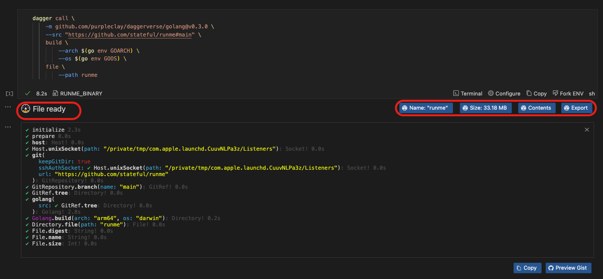

---
runme:
  id: 01J5TMAKC9QEMWB806SMQZZPZX
  version: v3
---

# Runme for Dagger

In this guide, we will explain step-by-step how to integrate Dagger into Runme and how it works.

## Getting Started

To proceed with this guide, it is crucial to carry out the following actions:

- **Install Runme**

Install the [Runme extension](https://marketplace.visualstudio.com/items?itemName=stateful.runme) in your VS Code editor. Runme also provides other [client interfaces](../installation/index.md) where you can run your Markdown file. Once installed, you can make Runme your [default Markdown viewer](../installation/installrunme#how-to-set-vs-code-as-your-default-markdown-viewer).

- **Install Docker(if not already installed)**

Get Docker installed and running on your local machine. You can download Docker from the [official website](https://www.docker.com/). After downloading Docker, you need to keep it running before executing any command.

- **Install Dagger**

Install Dagger on your local machine. The [Dagger installation guide](https://docs.dagger.io/install/) provides more information on how to install Dagger on any platform of your choice. if you have brew installed already run the command below to install dagger

```sh {"id":"01J6CH26D7HCJXVZXA2CATX4A2"}
brew install dagger/tap/dagger
```

## Navigating the Dagger CLI Using Runme Notebooks

Dagger CLI is the core tool used to interact with Dagger’s functions. You can chain commands and build entire DevOps pipelines by calling dagger functions from the CLI.

This section will explore navigating the Dagger CLI in your Runme Notebooks. We will explain how it works in detail.

### Writing Dagger Module within Runme Notebook cell

Runme Notebook interface includes a terminal environment with [additional features](../getting-started/features.md), that gives you the experience of working in your regular terminal and more. With the Runme Notebook interface, you can write and execute Dagger commands.

Let’s explore the code block below.

```sh {"id":"01J5TMAKC9QEMWB806SC1V5WH9"}
dagger call \
    -m github.com/purpleclay/daggerverse/golang@v0.3.0 \
    --src "https://github.com/stateful/runme#main" \
    build \
        --arch $(go env GOARCH) \
        --os $(go env GOOS) \
    file \
        --path runme
```

This code uses the Dagger CLI to build a [Go](https://go.dev/) project from the `runme` GitHub repository using your system's architecture and Operating System. After the build, it fetches a specific file from the `runme` project.

Output:


This output shows the steps executed by Dagger, which successfully performed the tasks in the code block.

### Runme Interactive CLI Support

Runme offers additional support for the Dagger CLI by providing options and support based on the context of your current task.

When you insert a Dagger command into a Runme cell, Runme automatically provides helpful CLI options based on the type of result returned (like a file, directory, or text). It shows buttons like "Export" or "Size," allowing you to run the next step with a quick click.



To retrieve the file's name, click on `Name`. A code block similar to the one below will be created and automatically run to display the file's name.

```sh {"id":"01J5TMAKC9QEMWB806SD1HE7V2"}
dagger call \
    -m github.com/purpleclay/daggerverse/golang@v0.3.0 \
    --src "https://github.com/stateful/runme#main" \
    build \
        --arch $(go env GOARCH) \
        --os $(go env GOOS) \
    file \
        --path runme name
```

To get the size of your file, click on `size`. A code block similar to the one below will be created and automatically run to display the size of your file.

```sh {"id":"01J5TMAKC9QEMWB806SGS12GGQ"}
dagger call --progress=$PROGRESS \
  -m golang \
  --src ../runme \
  build \
  file \
    --path runme size
```

To view the contents of your file, click on `content`. A code block similar to the one below will be created and automatically run to display the contents of your file.

```sh {"id":"01J6CGP8A99T2G7DAH034553Y3"}
# This code block will show the contents of your specified file
dagger call \
    -m github.com/purpleclay/daggerverse/golang@v0.3.0 \
    --src "https://github.com/stateful/runme#main" \
    file \
    --path runme contents
```

To export your file, click on `export`. First, you will be prompted to choose where you'd like to save the file, and the file path will be displayed. After selecting the location, a code block similar to the one below will be created and automatically run to export your file.

```sh {"id":"01J6CGXQT45FJABBDFKYFE2EXW"}
# This code block will export the specified file from your project
dagger call \
    -m github.com/purpleclay/daggerverse/golang@v0.3.0 \
    --src "https://github.com/stateful/runme#main" \
    build \
        --arch $(go env GOARCH) \
        --os $(go env GOOS) \
    file \
    --path runme export --path runme
```

### Running Dagger Functions with a Single Click

With the Runme interactive interface, you can run your Dagger functions with a single click. When you set up a function call within a notebook cell, Runme improves the experience by offering follow-up actions tailored to the return type.

This interactive interface makes the execution of complex pipelines easy and eliminates the need to type follow-up commands manually.

<video autoPlay loop muted playsInline controls>
  <source src="/videos/runme-dagger-output.mp4" type="video/mp4" />
  <source src="../../static/videos/runme-dagger-output.mp4" type="video/mp4" />
  <source src="/videos/runme-dagger-output.webm" type="video/webm" />
  <source src="../../static/videos/runme-dagger-output.webm" type="video/webm" />
</video>
<br/>

## Running Dagger Pipelines in Runme (using the CLI)

More than just running Dagger commands, developing pipelines, or troubleshooting them in VSCode, Runme also helps you run your Dagger pipelines inside your notebook through the Runme CLI.

If you have a Markdown file with your dagger pipeline commands written, you can run your pipeline from the terminal by running this command `$ runme run --filename my-notebook.md --all --skip-prompts`.

<video autoPlay loop muted playsInline controls>
  <source src="/videos/runme-dagger-demo.mp4" type="video/mp4" />
  <source src="../../static/videos/runme-dagger-demo.mp4" type="video/mp4" />
  <source src="/videos/runme-dagger-demo.webm" type="video/webm" />
  <source src="../../static/videos/runme-dagger-demo.webm" type="video/webm" />
</video>
<br/>

You can also run individual cells using the names of the cells or select them individually from Runme’s TUI.

<video autoPlay loop muted playsInline controls>
  <source src="/videos/runme-tui-dagger.mp4" type="video/mp4" />
  <source src="../../static/videos/runme-tui-dagger.mp4" type="video/mp4" />
  <source src="/videos/runme-tui-dagger.webm" type="video/webm" />
  <source src="../../static/videos/runme-tui-dagger.webm" type="video/webm" />
</video>
<br/>

To learn more about how the Runme CLI functions and how to use it for your project, check out [our documentation.](https://docs.runme.dev/how-runme-works/cli)

## Additional Resources

To learn more about Runme, see more resources on Runme Integrations:

[Runme Cloud Renderers](https://docs.runme.dev/integrations/cloud-render/)

[Data Rendering with Runme and JSON](https://docs.runme.dev/integrations/data-rendering)

[How to Use Foyle AI with Runme](https://docs.runme.dev/integrations/foyle)
