import Infobox from "../../src/components/Infobox.tsx"

Runme lets you execute interactive runbooks built with markdown. Some of the key features include:

## Runme Notebook

**Run a command block**

To run a command, simply click the run button (may require your mouse over the command in some themes). You will notice that this turns into a stop button for hung or long-running commands, which can be used to kill the terminal process.

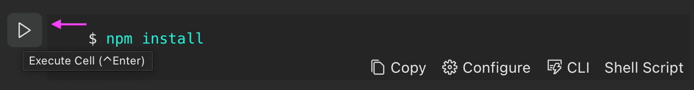

A succeeding exit code will be indicated with the small green checkbox seen below:

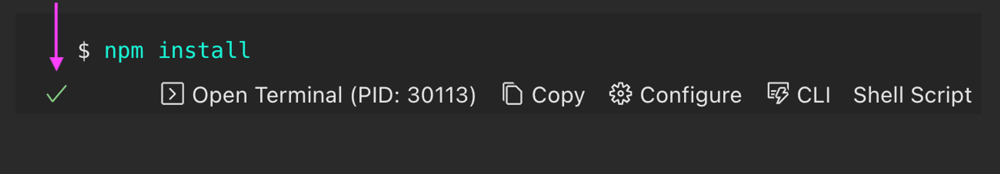

You can also open the terminal that did the execution by clicking the “Open Terminal” button as shown above with its PID.

**Copy & Paste**

Outside of literally running commands, Runme offers the ability to quickly copy commands (with the click of a button) out of a markdown file to paste into your terminal.

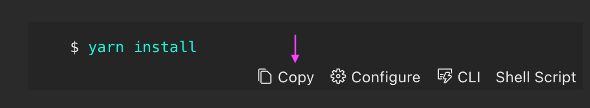

**Run all command blocks**

To run all the commands in the notebook in the order they are found, you can click the “Run All” button.

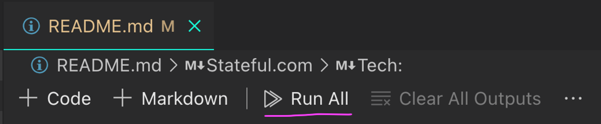

To be extra safe, you will be prompted before each step to confirm your intentions unless you select “Skip Prompt and run all”.

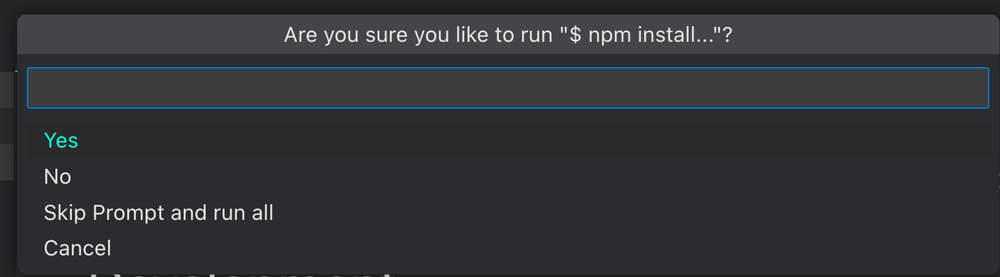

## Environment Variable Prompts

To keep generic notebooks/runbooks for your users:

If you are using environment variables within your runs, you can configure them within each cell and even make them interactive according to your particular needs. For example, we can configure the SLEEP_SECS environment variable to 10 seconds. Tremendously helpful whenever your runbooks require user-specific values.

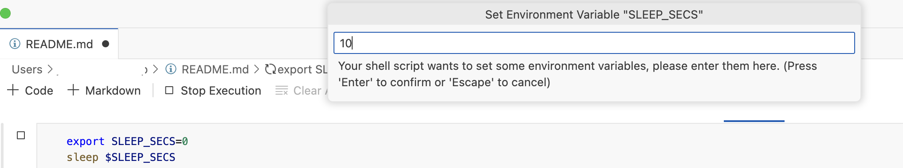

## Render images, CSV tables, and terminals inside markdown

While allowing background tasks to run seamlessly :

Each cell can be configured to be run in different manners. The idea is to give you more control over what you expect a user to modify vs. the parts you don't, and provide you with the output in a way that suits most.

You don’t need to wait for a run to finish? Just turn on background mode, and continue running following cells.

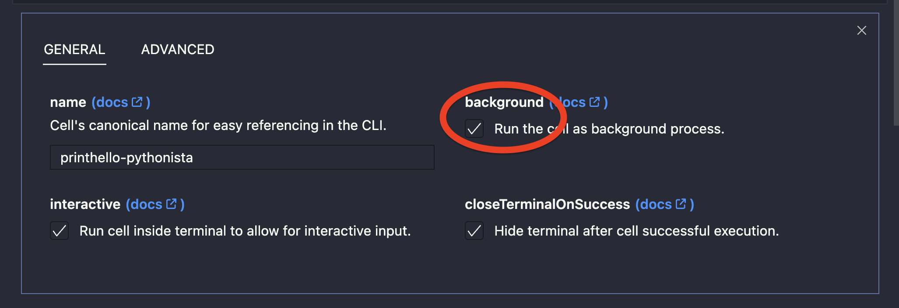

Do you need to prevent inputs in the terminal? Turn off interactive mode.

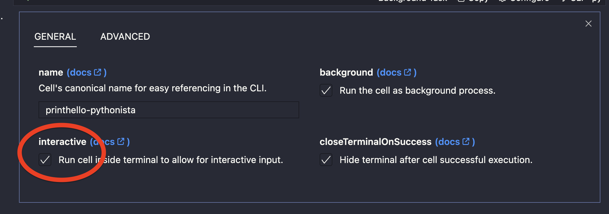

Do you need other MIME types to render images or CSV-based tables? You can configure it in the following cell option!

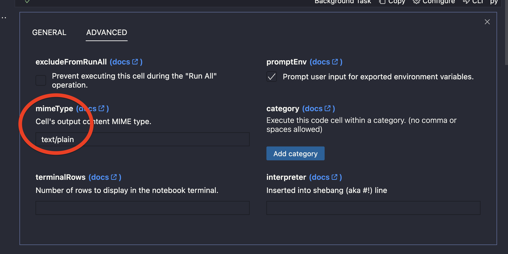

Including the following

- text/x-json
- text/x-javascript
- text/x-html
- image/png
- image/svg+xml
- text/csv

## Shebang support

Call into libraries or APIs to describe tasks with the programming language that’s most natural:

you can now run all sorts of programming languages inside your notebooks, including PHP, Ruby, Python, Lua, and more.

By default, Runme can run languages that are installed on your machine.

Runme supports a set of different interpreter for you to run cells in. To define an interpreter you can either:

- set a language id for the fenced code block

```sh {"id":"01HKB2KCYS7Y97X9A8K3CDP0Z1"}
puts 'Hello World'
```


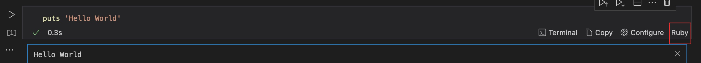

- set a shebang for the cell.

```sh {"id":"01HKMCNEJFN01DA4WRC187AYYK"}
#!/usr/bin/python3
print('Hello World!')
```

- set cell interpreter cell property as frontmatteror via VS Code cell option:

```sh {"id":"01HKB2N47GFSSPVZBTMK3X89W5"}
import sys

print("Python Version:", sys.version)
```

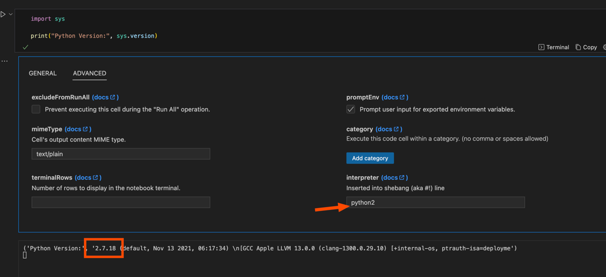

### Supported Interpreters

Check the list of [auto-detected interpreters](https://docs.runme.dev/configuration/shebang#list-of-auto-detected-language-runtimes) here for a complete list.

## Bridge the gaps between the terminal, editor, and browser

All inside markdown:

The outputs of each run are displayed in the notebook itself. No need to open another terminal or a browser or a native app - just keep working within markdown. On top of that, you can even see images, tables, and more!

## Manage resources like Vercel, Deno Cloud, or GitHub Actions directly from within markdown:

You can integrate other platforms and, for example, trigger GitHub Actions to run within your notebooks. Already have an action set up to work the particular task? Just dispatch it!

GitHub Actions provide a robust CI/CD platform for automating development tasks. Users can trigger these [workflows](https://docs.github.com/en/actions/using-workflows/about-workflows) in Runme by pasting specific GitHub URLs. Once the cell’s executed a form to input the required parameters displays, which lets users dispatch the workflow with a single click.

<video autoPlay loop muted playsInline controls>
  <source src="/videos/release-github-action.mp4" type="video/mp4" />
  <source src="/videos/release-github-action.webm" type="video/webm" />
</video>

Ensure your runbooks/notebooks work consistently by integrating them with the dedicated GitHub Action or using the CLI:

Runme offers a convenient GitHub Action that seamlessly integrates with your CI/CD pipeline. By re-using the notebook’s workflows in your CI/CD pipeline, you can ensure that your instructions never go out of date and remain relevant.

Let’s see the following `CONTRIBUTING.md` file:

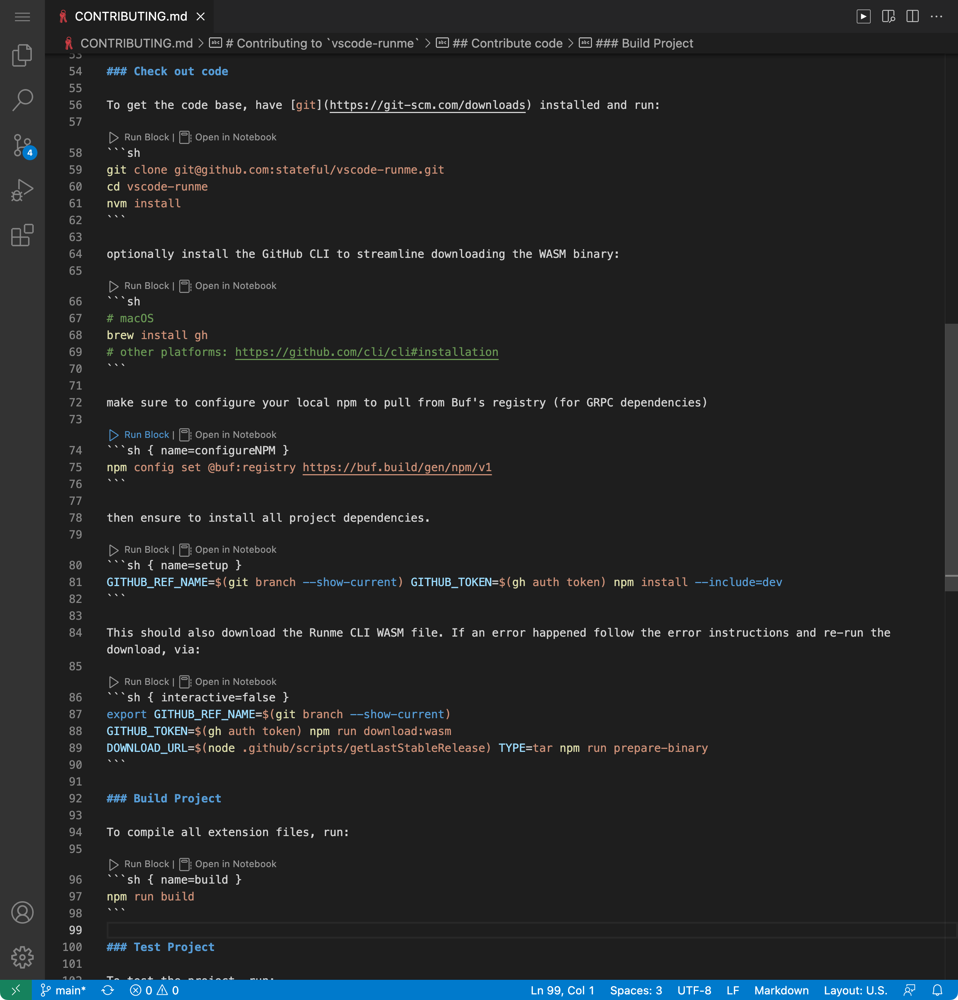

Pretty standard. Note the name tags in the code blocks, which help us to uniquely reference the command block via the **[Runme CLI](https://docs.runme.dev/install#runme-cli)**. All we really need to do now is to run your CI/CD pipeline the same step a human contributor would; command-by-command following the documentation.

To cut down on boilerplate, we've put together this handy **[GitHub Action](https://github.com/stateful/runme-action/)** for you to use inside your workflows like so:

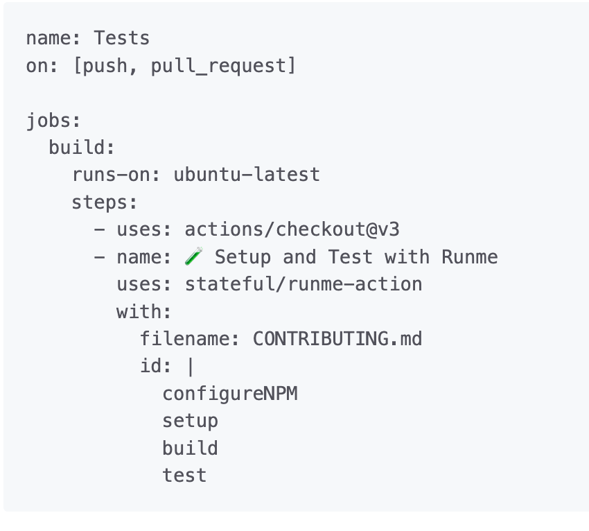

That's it! Instead of calling Makefiles targets or NPM scripts that remain undocumented and disconnected from your internal documentation, you can put your Markdown from and center of both humans and machines. Integration test onboarding and other workflows on every commit! Read more in the following blog: The Hitchhiking Contributor’s Guide to Onboarding Docs in [CI/CD](https://runme.dev/blog/guide-to-onboarding-docs-in-ci).

## Runme Cells

### Chain Cell Output

With the `$__` parameter you can transfer the stdout result of the last execution into your next execution:


### Sidenote

Please be aware that if the execution of a cell depends on the standard output (stdout) of a preceding cell, it is imperative to execute these cells sequentially. Failure to adhere to this sequence could lead to unintended and unpredictable behavior.

## Other key features

- Installs in seconds. No external dependencies are required.
- Persistent environment variables across cell and session runs.
- Single-click experiences to accomplish subsets of steps inside larger workflows, like setting up an environment, cleaning up stale EC2 instances, or deploying to staging.
- Start a session in the editor, complete environment variables in the notebook, and finish up a workflow in the terminal — all sharing the same session.
- Open tech and open formats at the core (e.g. VS Code Platform and Markdown).
- Compatible with existing task management (Makefile, Docker, NPM/Pipfile, Rake, etc).
