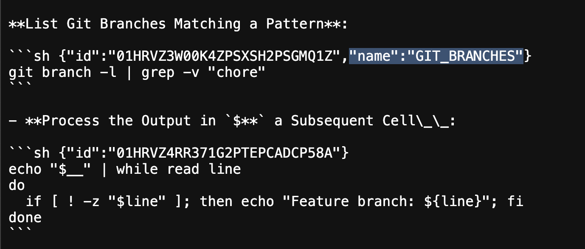

# Usage of Piping and Variables

Runme works a lot like a terminal, however, unlike Python's Jupyter it does not allow block-scope sharing of variables. Instead, you are encourage to use environment variables for inter-referencing of cells. Similar to how piping in and out of commands would work. Piping works in two ways. 1.) It's declared using `$__` to pass a variable declared in a previous execution to another cell or 2.) using a ENV variable.

Runme swiftly allows for complex piping and usage of variables across cells. Here is an example using Git with `$__` (reference the previous execution result):

**List Git Branches Matching a Pattern**:

```sh {"id":"01HRVZ3W00K4ZPSXSH2PSGMQ1Z","name":"GIT_BRANCHES"}
git branch -l | grep -v "chore"
```

**Process the Output inside `$GIT_BRANCHES` in a Subsequent Cell**:

```sh {"id":"01HRVZ4RR371G2PTEPCADCP58A"}
echo "$__" | while read line
do
  if [ ! -z "$line" ]; then echo "Feature branch: ${line}"; fi
done
```

**Process a ENV-variable-named Output**:

Please note how above's cell is conveniently available in the environment via `$GIT_BRANCHES` (see screen below or [inspect raw markdown](https://raw.githubusercontent.com/stateful/docs.runme.dev/refs/heads/main/docs/usage/pipes-variables.md)). Only cells named with uppercase letters and separated by underscores (min length is 3) are exported as environment variables:



The convention is simple e.g.:

- MY_VARIABLE
- SOME_OUTPUT
- A2B3C4

```sh {"id":"01HXFK8E3M7CYHBXQ4MTGD8PDT"}
echo -n "$GIT_BRANCHES" | grep -v "main"
```
